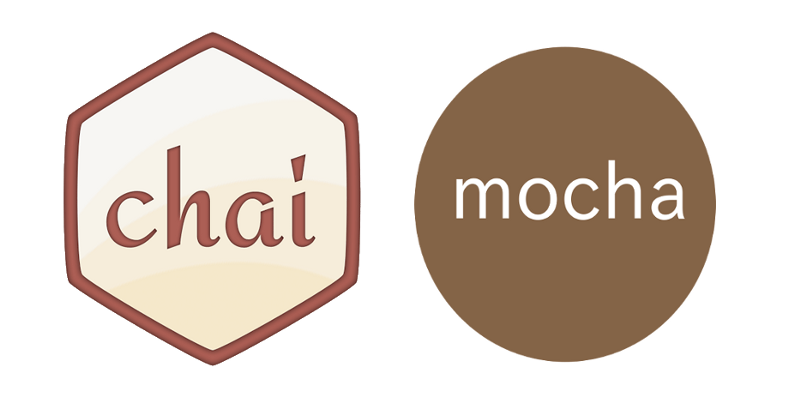

# 附錄三、React 測試入門教學



## 前言
測試是軟體開發中非常重要的一個環節，本章我們將帶領大家從撰寫最簡單的測試程式碼到整合 `Mocha` + `Chai` 官方提供的[測試工具](https://facebook.github.io/react/docs/test-utils.html)和 Airbnb 所設計的 [Enzyme](https://github.com/airbnb/enzyme) 進行 React 測試。

## Mocha 測試初體驗
[Mocha](https://mochajs.org/) 是目前頗為流行的 JavaScript 測試框架之一，其可以很方便使用於瀏覽器端和 Node 環境。

>Mocha is a feature-rich JavaScript test framework running on Node.js and in the browser, making asynchronous testing simple and fun. Mocha tests run serially, allowing for flexible and accurate reporting, while mapping uncaught exceptions to the correct test cases.

除了 Mocha 外，尚有許多 JavaScript 單元測試工具可以選擇，例如：[Jasmine](http://jasmine.github.io/)、[Karma](http://karma-runner.github.io/1.0/index.html) 等。但本章我們主要使用 `Mocha` + `Chai` 結合 React 官方測試工具和 Enzyme 進行講解。

在這邊我們先介紹一些比較常用的 Mocha 使用方法，讓大家熟悉測試的用法（若是已經熟悉撰寫測試程式碼的讀者這部份可以跳過）：

1. 安裝環境與套件

	安裝 `react` 和 `react-dom`

	```
	$ npm install --save react react-dom
	```

	可以在全域安裝 mocha：  

	```
	$ npm install --global mocha
	```

	也可以在開發環境下本地端安裝（同時安裝了 babel、eslint、webpack 等相關套件，其中以 mocha、chai、babel 為主要必須）：

	```
	$ npm install --save-dev babel-core babel-loader babel-eslint babel-preset-react babel-preset-es2015 eslint eslint-config-airbnb eslint-loader eslint-plugin-import eslint-plugin-jsx-a11y eslint-plugin-react webpack webpack-dev-server html-webpack-plugin chai mocha
	```

2. 測試程式碼
	1. describe（test suite）：表示一組相關的測試。`describe` 為一個函數，第一個參數為 `test suite`的名稱，第二個參數為實際執行的函數。
	2. it（test case）：表示一個單獨測試，為測試裡最小單位。`it` 為一個函數，第一個參數為 `test case` 的描述名稱，第二個參數為實際執行的函數。

	在測試程式碼中會包含一個或多個 `test suite`，而每個 `test suite` 則會包含一個或多個 `test case`。

3. 整合 assertion 函式庫 `Chai`

	所謂的 assertion（斷言），就是判斷程式碼的執行成果是否和預期一樣，若是不一致則會發生錯誤。通常一個 test case 會擁有一個或多個 assertion。由於 Mocha 本身是一個測試框架，但不包含 assertion，所以我們使用 [Chai](http://chaijs.com/) 這個適用於瀏覽器端和 Node 端的 BDD / TDD assertion library。在 Chai 中共提供三種操作 assertion 介面風格：Expect、Assert、Should，在這邊我們選擇使用比較接近自然語言的 Expect。

	基本上，expect assertion 的寫法都是類似：開頭為 `expect` 方法 + `to` 或 `to.be` + 結尾 assertion 方法（例如：equal、a/an、ok、match）

4. Mocha 基本用法

	mocha 若沒指定要執行哪個檔案，預設會執行 `test` 資料夾下第一層的測試程式碼。若要讓 `test` 資料夾中的子資料夾測試碼也執行則要加上 `--recursive` 參數。 

	包含子資料夾：

	```
	$ mocha --recursive
	```

	指定一個檔案

	```
	$ mocha file1.js 
	```

	也可以指定多個檔案

	```
	$ mocha file1.js file2.js
	```

	現在，我們來撰寫一個簡單的測試程式，親身感受一下測試的感覺。以下是 `react-mocha-test-example/src/modules/add.js`，一個加法的函數：

	```javascript
	const add = (x, y) => (
	  x + y
	);

	export default add;
	```

	接著我們撰寫測試這個函數的程式碼，測試是否正確。以下是 `react-mocha-test-example/src/test/add.test.js`：

	```
	// test add.js
	import add from '../src/modules/add';
	import { expect } from 'chai';

	// describe is test suite, it is test case
	describe('test add function', () => (
	  it('1 + 1 = 2', () => (
	    expect(add(1, 1)).to.be.equal(2)
	  ))
	));
	```

	在開始執行 `mocha` 後由於我們使用了，ES6 的語法所以必須使用 bable 進行轉譯，否則會出現類似以下的錯誤：

	```
	import add from '../src/modules/add';
	^^^^^^
	```

	我們先行設定 `.bablerc`，我們在之前已經有安裝 `babel` 相關套件和 `presets` 所以就會將 ES2015 語法轉譯。

	```
	{
		"presets": [
	  	"es2015",
	  	"react",
	 	],
		"plugins": []
	}
	```

	此時，我們更改 `package.json` 中的 `scripts`，這樣方便每次測試執行：

	若是使用本地端：

	```
	$ ./node_modules/mocha/bin/mocha --compilers js:babel-core/register
	```

	若是使用全域：

	```
	$ mocha --compilers js:babel-core/register
	```

	若是一切順利，我們就可以看到執行測試成功的結果：

	```
	$ mocha add.test.js

	  test add function
	    ✓ 1 + 1 = 2


	  1 passing (181ms)
	```

5. Mocha 指令參數

	在 Mocha 中有許多可以使用的好用參數，例如：`--recursive` 可以執行執行測試資料夾下的子資料夾程式碼、`--reporter 格式` 更改測試報告格式（預設是 `spec`，也可以更改為 `tap`）、`--watch` 用來監控測試程式碼，當有測試程式碼更新就會重新執行、`--grep` 擷取符合條件的 test case。

	以上這些參數我們可以都整理在 `test` 資料夾下的 `mocha.opts` 檔案中當作設定資料，此時再次執行 `npm run test` 就會把參數也使用進去。

	```
	--watch
	--reporter spec
	```

6. 非同步測試

	在上面我們討論的主要是同步的狀況，但實際上在開發應用時往往會遇到非同步的情形。而在 Mocha 中每個 test case 最多允許執行 2000 毫秒，當時間超過就會顯示錯誤。為了解決這個問題我們可以在 `package.json` 中更改：`"test": "mocha -t 5000 --compilers js:babel-core/register"` 檔案。

	為了模擬測試非同步的情境，所以我們必須先安裝 [axios](https://github.com/mzabriskie/axios)。

	```
	$ npm install --save axios
	```

	以下是 `react-mocha-test-example/src/test/async.test.js`：

	```javascript
	import axios from 'axios';
	import { expect } from 'chai';

	it('asynchronous return an object', function(done){
	  axios
	    .get('https://api.github.com/users/torvus')
	    .then(function (response) {
	      expect(response).to.be.an('object');
	      done();
	    })
	    .catch(function (error) {
	      console.log(error);
	    });
	});
	```

	由於測試環境是在 Node 中，所以我們必須先安裝 [node-fetch](https://github.com/bitinn/node-fetch) 來展現 promise 的情境。

	```
	$ npm install --save node-fetch 
	```

	以下是 `react-mocha-test-example/src/test/promise.test.js`：

	```javascript
	import fetch from 'node-fetch';
	import { expect } from 'chai';

	it('asynchronous fetch promise', function() {
	  return fetch('https://api.github.com/users/torvus')
	    .then(function(response) { return response.json() })
	    .then(function(json) { 
	      expect(json).to.be.an('object');
	    });
	});
	```

7. 測試使用的 hook

	在 Mocha 中的 test suite 中，有 before()、after()、beforeEach() 和 afterEach() 四種 hook，可以讓你設計在特定時間點執行測試。

	```javascript
	describe('hooks', function() {
	  before(function() {
	    // 在 before 中的 test case 會在所有 test cases 前執行
	  });
	  after(function() {
	    // 在 after 中的 test case 會在所有 test cases 後執行
	  });
	  beforeEach(function() {
	    // 在 beforeEach 中的 test case 會在每個 test cases 前執行
	  });
	  afterEach(function() {
	    // 在 afterEach 中的 test case 會在每個 test cases 後執行
	  });
	  // test cases
	});
	```

## 動手實作
在上面我們已經先講解了 `Mocha` + `Chai` 測試工具和基礎的測試寫法。現在接著我們要來探討 React 中的測試用法。然而，要在 React 中測試 Component 以及 JSX 語法時，使用傳統的測試工具並不方便，所以要整合 `Mocha` + `Chai` 官方提供的[測試工具](https://facebook.github.io/react/docs/test-utils.html)和 Airbnb 所設計的 [Enzyme](https://github.com/airbnb/enzyme)（由於官方的測試工具使用起來不太方便所以有第三方針對其進行封裝）進行測試。

### 使用官方測試工具
我們知道在 React 一個重要的特色為 Virtual DOM 所以在官方的測試工具中有提供測試 Virtual DOM 的方法：Shallow Rendering（createRenderer），以及測試真實 DOM 的方法：DOM Rendering（renderIntoDocument）。

1. Shallow Rendering（createRenderer）

	Shallow Rendering 係指將一個 Virtual DOM 渲染成子 Component，但是只渲染第一層，不渲染所有子元件，因此處理速度快且不需要 DOM 環境。Shallow rendering 在單元測試非常有用，由於只測試一個特定的 component，而重要的不是它的 children。這也意味著改變一個 child component 不會影響 parent component 的測試。

	以下是 `react-addons-test-utils-example/src/test/shallowRender.test.js`：

	```javascript
	import React from 'react';
	import TestUtils from 'react-addons-test-utils';
	import { expect } from 'chai';
	import Main from '../src/components/Main';

	function shallowRender(Component) {
	  const renderer = TestUtils.createRenderer();
	  renderer.render(<Component/>);
	  return renderer.getRenderOutput();
	}

	describe('Shallow Rendering', function () {
	  it('Main title should be h1', function () {
	    const todoItem = shallowRender(Main);
	    expect(todoItem.props.children[0].type).to.equal('h1');
	    expect(todoItem.props.children[0].props.children).to.equal('Todos');
	  });
	});
	```

	以下是 `react-addons-test-utils-example/src/test/shallowRenderProps.test.js`：	

	```javascript
	import React from 'react';
	import TestUtils from 'react-addons-test-utils';
	import { expect } from 'chai';
	import TodoList from '../src/components/TodoList';

	const shallowRender = (Component, props) => {
	  const renderer = TestUtils.createRenderer();
	  renderer.render(<Component {...props}/>);
	  return renderer.getRenderOutput();
	}

	describe('Shallow Props Rendering', () => {
	  it('TodoList props check', () => {
	    const todos = [{ id: 0, text: 'reading'}, { id: 1, text: 'coding'}];
	    const todoList = shallowRender(TodoList, {todos: todos});
	    expect(todoList.props.children.type).to.equal('ul');
	    expect(todoList.props.children.props.children[0].props.children).to.equal('reading');
	    expect(todoList.props.children.props.children[1].props.children).to.equal('coding');
	  });
	});
	```

2. DOM Rendering（renderIntoDocument）
	
	注意，因為 Mocha 運行在 Node 環境中，所以你不會存取到 DOM。所以我們要使用 JSDOM 來模擬真實 DOM 環境。同時我在這邊引入 `react-dom`，這樣我們就可以使用 findDOMNode 來選取元素。事實上，findDOMNode 方法的最大優勢是提供比 TestUtils 更好的 CSS 選擇器，方便開發者選擇元素。

	以下是 `react-addons-test-utils-example/src/test/setup.test.js`：	

	```javascript
	import jsdom from 'jsdom';

	if (typeof document === 'undefined') {
	  global.document = jsdom.jsdom('<!doctype html><html><head></head><body></body></html>');
	  global.window = document.defaultView;
	  global.navigator = global.window.navigator;
	}
	```

	以下是 `react-addons-test-utils-example/src/components/TodoHeader/TodoHeader.js`：	

	```javascript
	import React from 'react';

	class TodoHeader extends React.Component {
	  constructor(props) {
	    super(props);
	    this.toggleButton = this.toggleButton.bind(this);
	    this.state = {
	      isActivated: false,
	    };
	  }
	  toggleButton() {
	    this.setState({
	      isActivated: !this.state.isActivated,      
	    })
	  }
	  render() {
	    return (
	      <div>
	        <button disabled={this.state.isActivated} onClick={this.toggleButton}>Add</button>
	      </div>
	    );
	  };
	}

	export default TodoHeader;
	```

	需要留意的是若是 stateless components 使用 TestUtils.renderIntoDocument，要將 renderIntoDocument 包在 `<div></div>` 內，使用 `findDOMNode(TodoHeaderApp).children[0]` 取得，不然會回傳 null。更進一步細節可以[參考這裡](https://github.com/facebook/react/issues/4839)。不過由於我們是使用 `class-based` Component 所以不會遇到這個問題。

	以下是 `react-addons-test-utils-example/src/test/renderIntoDocument.test.js`：	

	```javascript
	import React from 'react';
	import TestUtils from 'react-addons-test-utils';
	import { expect } from 'chai';
	import { findDOMNode } from 'react-dom';
	import TodoHeader from '../src/components/TodoHeader';

	describe('Simulate Event', function () {
	  it('When click the button, it will be toggle', function () {
	    const TodoHeaderApp = TestUtils.renderIntoDocument(<TodoHeader />);
	    const TodoHeaderDOM = findDOMNode(TodoHeaderApp);
	    const button = TodoHeaderDOM.querySelector('button');
	    TestUtils.Simulate.click(button);
	    let todoHeaderButtonAfterClick = TodoHeaderDOM.querySelector('button').disabled;
	    expect(todoHeaderButtonAfterClick).to.equal(true);
	  });
	});
	```

	這種渲染 DOM 的測試方式類似於 JavaScript 或 jQuery 的 DOM 操作。首先要先找到欲操作的目標節點，而後觸發想要執行的動作，在官方測試工具中擁有許多可以[協助選取節點的方法](https://facebook.github.io/react/docs/test-utils.html#scryrenderedcomponentswithtype)。然而由於其在使用上不夠簡潔，也因此我們接下來將介紹由 Airbnb 所設計的 [Enzyme](https://github.com/airbnb/enzyme)進行 React 測試。

### 使用 Enzyme 函式庫進行測試
[Enzyme](https://github.com/airbnb/enzyme) 優勢是在於針對官方測試工具封裝成了類似 jQuery API 的選取元素的方式。根據官方網站介紹 Enzyme 將更容易地去操作選取 React Component：

> Enzyme is a JavaScript Testing utility for React that makes it easier to assert, manipulate, and traverse your React Components’ output.
Enzyme is unopinionated regarding which test runner or assertion library you use, and should be compatible with all major test runners and assertion libraries out there.

在 Enzyme 中選取元素使用 `find()`：

```javascript
component.find('.className'); // 使用 class 選取
component.find('#idName'); // 使用 id 選取
component.find('h1'); // 使用元素選取
```

接下來我們介紹 Enzyme 三個主要的 API 方法：

1. Shallow Rendering

	shallow 方法事實上就是官方測試工具的 shallow rendering 封装。同樣是只渲染第一層，不渲染所有子元件。

	```
	import React from 'react';
	import TestUtils from 'react-addons-test-utils';
	import { expect } from 'chai';
	import { shallow } from 'enzyme';
	import Main from '../../src/components/Main';

	describe('Enzyme Shallow Rendering', () => {
	  it('Main title should be Todos', () => {
	    const main = shallow(<Main />);
	    // 判斷 h1 文字是否如預期
	    expect(main.find('h1').text()).to.equal('Todos');
	  });
	});
	```

2. Static Rendering

	render 方法是將 React 元件渲染成靜態的 HTML 字串，並利用 Cheerio 函式庫（這點和 shallow 不同）分析其結構返回物件。雖然底層是不同的處理引擎但使用上 API 封裝起來和 Shallow 卻是一致的。需要注意的是 Static Rendering 非只渲染一層，需要注意是否需要 mock props 傳遞。

	```javascript
	import React from 'react';
	import TestUtils from 'react-addons-test-utils';
	import { expect } from 'chai';
	import { render } from 'enzyme';
	import Main from '../../src/components/Main';

	describe('Enzyme Staic Rendering', () => {
	  it('Main title should be Todos', () => {
	    const todos = [{ id: 0, text: 'reading'}, { id: 1, text: 'coding'}];
	    const main = render(<Main todos={todos} />);
	    expect(main.find('h1').text()).to.equal('Todos');
	  });
	});
	```

3. Full Rendering

	mount 方法 React 元件載入真實 DOM 節點。同樣因為牽涉到 DOM 也要使用 JSDOM。

	```javascript
	import React from 'react';
	import TestUtils from 'react-addons-test-utils';
	import { expect } from 'chai';
	import { findDOMNode } from 'react-dom';
	import { mount } from 'enzyme';
	import TodoHeader from '../../src/components/TodoHeader';

	describe('Enzyme Mount', () => {
	  it('Click Button', () => {
	    let todoHeaderDOM = mount(<TodoHeader />);
	    // 取得 button 並模擬 click
	    let button = todoHeaderDOM.find('button').at(0);
	    button.simulate('click');
	    // 檢查 prop(key) 是否正確
	    expect(button.prop('disabled')).to.equal(true);
	  });
	});
	```	

最後我們可以在 `react-addons-test-utils-example` 資料夾下執行：

```
$ npm test
```

若一切順利就可以看到測試通過的訊息！

```

  Enzyme Mount
    ✓ Click Button (44ms)

  Enzyme Shallow Rendering
    ✓ Main title should be Todos

  Enzyme Staic Rendering
    ✓ Main title should be Todos

  Simulate Event
    ✓ When click the button, it will be toggle

  Shallow Rendering
    ✓ Main title should be h1

  Shallow Props Rendering
    ✓ TodoList props check


  6 passing (279ms)

```

事實上 Enzyme 還提供更多的 API 可以使用，若是讀者想了解更多 Enzyme API 可以 [參考官方文件](http://airbnb.io/enzyme/docs/api/index.html)。

## 總結
以上我們從 `Mocha` + `Chai` 的使用方式介紹到 React 官方提供的[測試工具](https://facebook.github.io/react/docs/test-utils.html) 和 Airbnb 所設計的 [Enzyme](https://github.com/airbnb/enzyme)，相信讀者對於測試程式碼已經有初步的了解，若尚未掌握的讀者不妨跟著上面的範例再重新走過一遍，接著我們要進到最後的 `GraphQL/Relay`的介紹。

## 延伸閱讀
1. [React 测试入门教程](http://www.ruanyifeng.com/blog/2016/02/react-testing-tutorial.html)
2. [测试框架 Mocha 实例教程](http://www.ruanyifeng.com/blog/2015/12/a-mocha-tutorial-of-examples.html)
3. [Test Utilities](https://facebook.github.io/react/docs/test-utils.html)
4. [JavaScript Testing utilities for React](https://github.com/airbnb/enzyme)
5. [持续集成是什么？](http://www.ruanyifeng.com/blog/2015/09/continuous-integration.html)
6. [Let’s test React components with TDD, Mocha, Chai, and jsdom](https://medium.freecodecamp.com/simple-react-testing-d9e25ec87e2)
7. [Unit Testing React-Native Components with Enzyme Part 1](https://kyrisu.com/2016/01/31/unit-testing-react-native-components-with-enzyme-part-1/)
8. [What React Stateless Components Are Missing](http://jaketrent.com/post/react-stateless-components-missing/)
9. [0.14-rc1: findDOMNode(statelessComponent) doesn’t work with TestUtils.renderIntoDocument #4839](https://github.com/facebook/react/issues/4839)
10. [Writing Redux Tests](http://redux.js.org/docs/recipes/WritingTests.html)
11. [【译】展望2016，React.js 最佳实践 (中英对照版)](http://blog.jimmylv.info/2016-01-22-React.js-Best-Practices-for-2016/)

（image via [Anthony Ng](https://cdn-images-1.medium.com/max/800/1*CrB6isZN6YXeM1rWmnjxHw.png)）

## :door: 任意門
| [回首頁](https://github.com/kdchang/reactjs101) | [上一章：附錄二、用 React Native + Firebase 開發跨平台行動應用程式](https://github.com/kdchang/reactjs101/blob/master/Appendix02/README.md) | [下一章：附錄四、GraphQL/Relay 初體驗](https://github.com/kdchang/reactjs101/blob/master/Appendix04/README.md) |

| [勘誤、提問或許願](https://github.com/kdchang/reactjs101/issues) |
