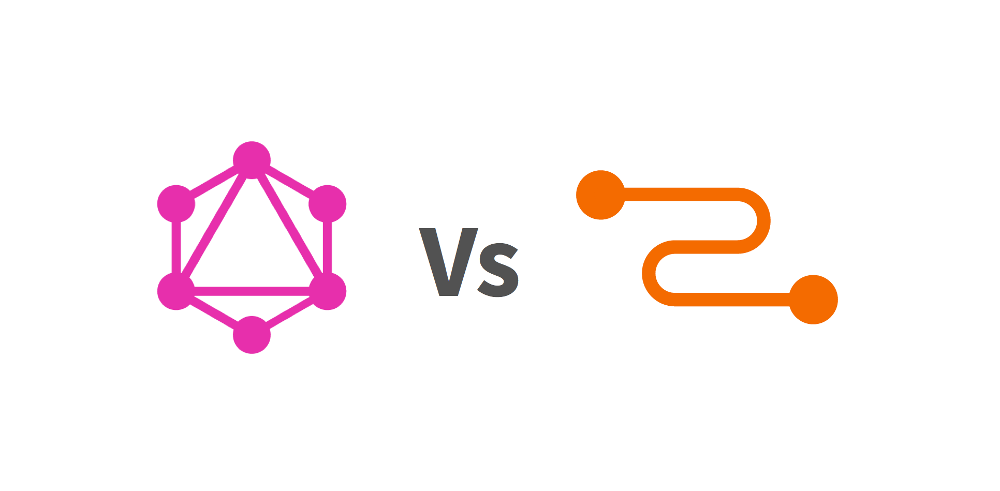
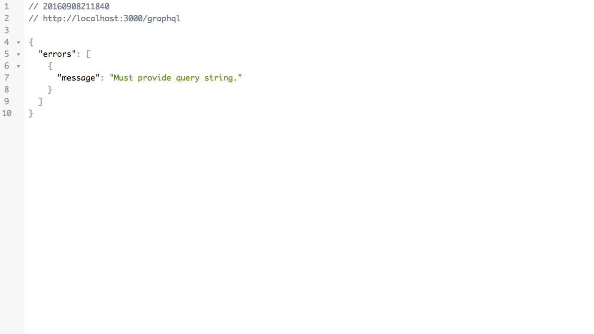
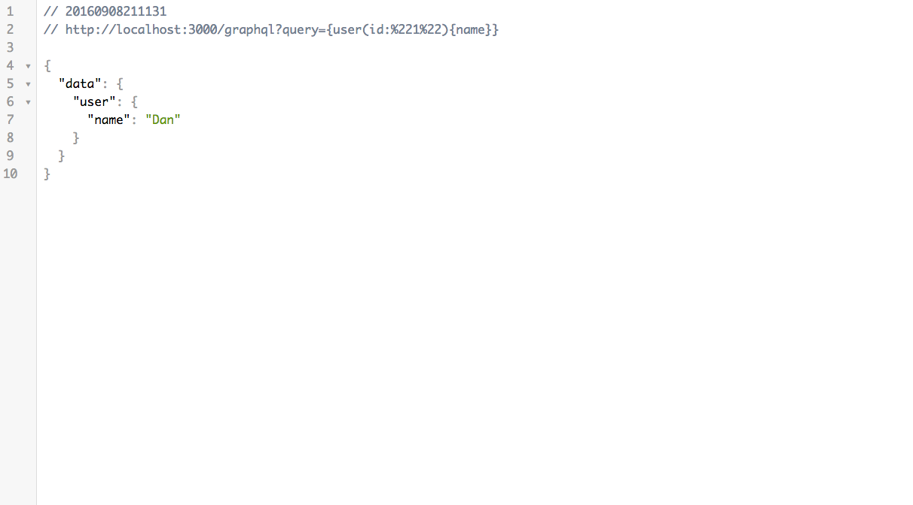

# 附錄四、GraphQL/Relay 初體驗



## 前言
GraphQL 的出現主要是為了要解決 Web/Mobile 端不斷增加的 API 請求所衍生的問題。由於 RESTful 最大的功能在於很有效的前後端分離和建立 stateless 請求，然而 RESTful API 的資源設計上比較偏向單方面的互動，若是有著複雜資源間的關聯就會出現請求次數過多，遇到不少的瓶頸。

## GraphQL 初體驗

>GraphQL is a data query language and runtime designed and used at Facebook to request and deliver data to mobile and web apps since 2012.

根據 [GraphQL 官方網站](http://graphql.org/)的定義，GraphQL 是一個資料查詢語言和 runtime。Query responses 是由 client 所宣告決定，而非 server 端，且只會回傳 client 所宣告的內容。此外，GraphQL 是強型別（strong type）且可以容易使用階層（hierarchical）和處理複雜的資料關連性，並更容易讓前端工程師和產品工程師定義 Schema 來使用，賦予前端對於資料的制定能力。

GraphQL 主要由以下元件構成：

1. 類別系統（Type System）
2. 查詢語言（Query Language）：在 Operations 中 query 只讀取資料而 mutation 寫入操作
3. 執行語意（Execution Semantics）
4. 靜態驗證（Static Validation）
5. 類別檢查（Type Introspection）

一般 RESTful 在取用資源時會對應到 HTTP 中 `GET`、`POST`、`DELETE`、`PUT` 等方法，並以 URL 對應的方式去取得資源，例如：

取得 id 為 3500401 的使用者資料：

GET `/users/3500401`

以下則是 GraphQL 宣告的 query 範例，宣告式（declarative）的方式比起 RESTful 感覺起來相對直觀：

```javascript
{
  user(id: 3500401) {
    id,
    name,
    isViewerFriend,
    profilePicture(size: 50)  {
      uri,
      width,
      height
    }
  }
}
```

接收到 GraphQL query 後 server 回傳結果：

```javascript
{
  "user" : {
    "id": 3500401,
    "name": "Jing Chen",
    "isViewerFriend": true,
    "profilePicture": {
      "uri": "http://someurl.cdn/pic.jpg",
      "width": 50,
      "height": 50
    }
  }
}
```

### 實戰演練

在 GraphQL 中有取得資料 Query、更改資料 Mutation 等操作。以下我們先介紹如何建立 GraphQL Server 並取得資料。

1. 環境建置
	接下來我們將動手建立 GraphQL 的簡單範例，讓大家感受一下 GraphQL 的特性，在這之前我們需要先安裝以下套件建立好環境：

	1. [graphql](https://github.com/graphql/graphql-js)：GraphQL 的 JavaScript 實作.
	2. [express](https://github.com/expressjs/express)：Node web framework.
	3. [express-graphql](https://github.com/graphql/express-graphql), an express middleware that exposes a GraphQL server.

	```
	$ npm init
	$ npm install graphql express express-graphql --save
	```

2. Data 格式設計

	以下是 `data.json`：

	```
	{
	  "1": {
	    "id": "1",
	    "name": "Dan"
	  },
	  "2": {
	    "id": "2",
	    "name": "Marie"
	  },
	  "3": {
	    "id": "3",
	    "name": "Jessie"
	  }
	}
	```

3. Server 設計

	```javascript
	// 引入函式庫
	import graphql from 'graphql';
	import graphqlHTTP from 'express-graphql';
	import express from 'express';
	
	// 引入 data
	const data = require('./data.json');

	// 定義 User type 的兩個子 fields：`id` 和 `name` 字串，注意型別對於 GraphQL 非常重要
	const userType = new graphql.GraphQLObjectType({
	  name: 'User',
	  fields: {
	    id: { type: graphql.GraphQLString },
	    name: { type: graphql.GraphQLString },
	  }
	});

	const schema = new graphql.GraphQLSchema({
	  query: new graphql.GraphQLObjectType({
	    name: 'Query',
	    fields: {
	      user: {
	      	// 使用上面定義的 userType
	        type: userType,
	        // 定義所接受的 user 參數
	        args: {
	          id: { type: graphql.GraphQLString }
	        },
			// 當傳入參數後 resolve 如何處理回傳 data
	        resolve: function (_, args) {
	          return data[args.id];
	        }
	      }
	    }
	  })
	});

	// 啟動 graphql server
	express()
	  .use('/graphql', graphqlHTTP({ schema: schema, pretty: true }))
	  .listen(3000);

	console.log('GraphQL server running on http://localhost:3000/graphql');
	```

	在終端機執行：

	```
	node index.js
	```

	這個時候我們可以打開瀏覽器輸入 ` localhost:3000/graphql.`，由於沒有任何 Query，目前會出現以下畫面：

	

4. Query 設計

	當 GraphQL 指令為：

	```javascript
	{
	  user(id: "1") {
	    name
	  }
	}
	```	

	將回傳資料：
	
	```javascript
	{
	  "data": {
	    "user": {
	      "name": "Dan"
	    }
	  }
	}
	```

	在了解了資料和 Query 設計後，這個時候我們可以打開瀏覽器輸入（當然也可以透過終端機 curl 的方式執行）：
	`http://localhost:3000/graphql?query={user(id:"1"){name}}`，此時 server 會根據 GET 的資料回傳：

	

到這裡，你已經完成了最簡單的 GraphQL Server 設計了，若你遇到編碼問題，可以嘗試使用 JavaScript 中的 `encodeURI` 去進行轉碼。也可以自己嘗試不同的 Schema 和 Query，感受一下 GraphQL 的特性。事實上，GraphQL 還擁有許多有趣的特色，例如：Fragment、指令、Promise 等，若讀者對於 GraphQL 有興趣可以進一步參考 [GraphQL 官網](http://graphql.org/)。

## Relay 初體驗

>Relay is a new framework from Facebook that provides data-fetching functionality for React applications.

在體驗完 GraphQL 後，我們要來聊聊 Relay。Relay 是 Facebook 為了滿足大型應用程式開發所建構的框架，主要用於處理 React 應用層（Application）的資料互動框架。在 Relay 中可以讓每個 Component 透過 GraphQL 的整合處理可以精確地向 Component props 提供取得的數據，並在 client side 存放一份所有數據的 store 當作暫存。

整個 Relay 架構流程圖：


一般來說要使用 Relay 必須先準備好以下三項工具：

1. A GraphQL Schema
	- [graphql-js](https://github.com/graphql/graphql-js)
	- [graphql-relay-js](https://github.com/graphql/graphql-relay-js)

2. A GraphQL Server
	- [express](https://github.com/expressjs/express)
	- [express-graphql](https://github.com/graphql/express-graphql)

3. Relay
	- [network layer](https://github.com/facebook/relay/tree/master/src/network-layer/default)：Relay 透過 network layer 傳 GraphQL 給 server

接下來我們來透過 React 官方上的範例來讓大家感受一下 Relay 的特性。上面我們有提過：在 Relay 中可以讓每個 Component 透過 GraphQL 的整合處理可以更精確地向 Component props 提供取得的數據，並在 client side 存放一份所有數據的 store 當作暫存。所以，首先我們先建立每個 Component 和 GraphQL/Relay 的對應：

```javascript
// 建立 Tea Component，從 this.props.tea 取得資料
class Tea extends React.Component {
  render() {
    var {name, steepingTime} = this.props.tea;
    return (
      <li key={name}>
        {name} (<em>{steepingTime} min</em>)
      </li>
    );
  }
}
// 使用 Relay.createContainer 建立資料溝通窗口 
Tea = Relay.createContainer(Tea, {
  fragments: {
    tea: () => Relay.QL`
      fragment on Tea {
        name,
        steepingTime,
      }
    `,
  },
});

class TeaStore extends React.Component {
  render() {
    return <ul>
      {this.props.store.teas.map(
        tea => <Tea tea={tea} />
      )}
    </ul>;
  }
}
TeaStore = Relay.createContainer(TeaStore, {
  fragments: {
    store: () => Relay.QL`
      fragment on Store {
        teas { ${Tea.getFragment('tea')} },
      }
    `,
  },
});

// Route 設計
class TeaHomeRoute extends Relay.Route {
  static routeName = 'Home';
  static queries = {
    store: (Component) => Relay.QL`
      query TeaStoreQuery {
        store { ${Component.getFragment('store')} },
      }
    `,
  };
}

ReactDOM.render(
  <Relay.RootContainer
    Component={TeaStore}
    route={new TeaHomeRoute()}
  />,
  mountNode
);
```

GraphQL Schema 和 store 建立：

```javascript
// 引入函式庫
import {
  GraphQLInt,
  GraphQLList,
  GraphQLObjectType,
  GraphQLSchema,
  GraphQLString,
} from 'graphql';

// client side 暫存 store，GraphQL Server reponse 會更新 store，再透過 props 傳遞給 Component
const STORE = {
  teas: [
    {name: 'Earl Grey Blue Star', steepingTime: 5},
    {name: 'Milk Oolong', steepingTime: 3},
    {name: 'Gunpowder Golden Temple', steepingTime: 3},
    {name: 'Assam Hatimara', steepingTime: 5},
    {name: 'Bancha', steepingTime: 2},
    {name: 'Ceylon New Vithanakande', steepingTime: 5},
    {name: 'Golden Tip Yunnan', steepingTime: 5},
    {name: 'Jasmine Phoenix Pearls', steepingTime: 3},
    {name: 'Kenya Milima', steepingTime: 5},
    {name: 'Pu Erh First Grade', steepingTime: 4},
    {name: 'Sencha Makoto', steepingTime: 2},
  ],
};

// 設計 GraphQL Type
var TeaType = new GraphQLObjectType({
  name: 'Tea',
  fields: () => ({
    name: {type: GraphQLString},
    steepingTime: {type: GraphQLInt},
  }),
});

// 將 Tea 整合進來
var StoreType = new GraphQLObjectType({
  name: 'Store',
  fields: () => ({
    teas: {type: new GraphQLList(TeaType)},
  }),
});

// 輸出 GraphQL Schema
export default new GraphQLSchema({
  query: new GraphQLObjectType({
    name: 'Query',
    fields: () => ({
      store: {
        type: StoreType,
        resolve: () => STORE,
      },
    }),
  }),
});
```

限於篇幅，我們只能讓大家感受一下 Relay 的簡單範例，若大家想進一步體驗 Relay 的優勢，已經幫你準備好 GraphQL Server、transpiler 的 [Relay Starter Kit](https://github.com/relayjs/relay-starter-kit) 專案會是個很好的開始。

## 總結
React 生態系中，除了前端 View 的部份有革新性的創新外，GraphQL 更是對於資料取得的全新思路。雖然 GraphQL 和 Relay 已經成為開源專案，但技術上仍持續演進，若需要在團隊 production 上導入仍可以持續觀察。到這邊，若是一路從第一章看到這裡的讀者真的要給自己一個熱烈掌聲了，我知道對於初學者來說 React 龐大且有許多的新的觀念需要消化，但如同筆者在最初時所提到的，學習 React 重要的是透過這個生態系去學習現代化網頁開發的工具和方法以及思路，成為更好的開發者。根據前端摩爾定律，每半年就有一次大變革，但基本 Web 問題和觀念依然不變，大家一起加油啦！若有任何問題都歡迎來信給筆者或是發 `issue`，當然 PR is welcome :) 

## 延伸閱讀
1. [Your First GraphQL Server](https://medium.com/the-graphqlhub/your-first-graphql-server-3c766ab4f0a2#.7e02np1rs)
2. [搭建你的第一个 GraphQL 服务器](http://qianduan.guru/2016/01/03/Your-First-GraphQL-Server/)
3. [Learn GraphQL](https://learngraphql.com/)
4. [GraphQL vs Relay](https://kadira.io/blog/graphql/graphql-vs-relay)
5. [GraphQL 官網](http://graphql.org/)
6. [Relay 官網](https://facebook.github.io/relay/)
7. [A reference implementation of GraphQL for JavaScript](https://github.com/graphql/graphql-js)
8. [深入理解 GraphQL](http://taobaofed.org/blog/2016/03/10/graphql-in-depth/)
9. [Node.js 服务端实践之 GraphQL 初探](http://taobaofed.org/blog/2015/11/26/graphql-basics-server-implementation/)

（image via [facebook](https://facebook.github.io/react/img/blog/relay-components/relay-architecture.png)、[kadira](https://cldup.com/uhBzqnK002.png)）

## :door: 任意門
| [回首頁](https://github.com/kdchang/reactjs101) | [上一章：附錄三、React 測試入門教學](https://github.com/kdchang/reactjs101/blob/master/Appendix03/README.md) | 

| [勘誤、提問或許願](https://github.com/kdchang/reactjs101/issues) |
