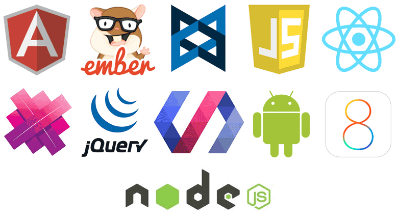

# Web 前端工程入門簡介

## 前言
隨著現代化網頁（Modern Web）開發專業和複雜性的提昇以及對於使用者體驗的要求下，網頁開發已從過去的 Web Developer 一夫當關，轉向專業分工，更加細分成網頁前端（Web Front End）、網頁後端（Web Back End）等職位。此外，由於跨平台、跨瀏覽器的需求日益增加，技術變化更迭快速，市場上對於前端工程師（Web Front End Engineer）的需求也與日俱增，前端工程的（Front End Engineering）所要面對的挑戰也越來越多。

## 前端工程範疇
事實上，在目前的業界，前端工程的定位光譜非常廣泛，有聚焦在網頁設計（Web Design），也有專注在軟體工程（Software Engineering）的部份，本書則是將前端工程定位在軟體工程的範疇。而 HTML、CSS 和 JavaScript 是前端工程最重要的技術基礎。過去一段時間，我們所認為的前端工程主要專注在瀏覽器平台，但現在的 Web 平台已經不再侷限於桌面瀏覽器，而是必須面對更多的跨平台、跨瀏覽器的應用開發場景，其中包含：

1. 網頁瀏覽器（Web Browser），一般的網頁應用程式開發
2. 透過 CLI 指令去操作的 Headless 瀏覽器（Headless　Application）。例如：[phantomJS](http://phantomjs.org/)、[CasperJS](http://casperjs.org/) 等
3. 運作在 WebView 瀏覽器核心（WebView Application）的應用。例如：[Apache Cordova](https://cordova.apache.org/)、[Electron](http://electron.atom.io/)、[NW.js](http://nwjs.io/) 等行動、桌面應用程式開發
4. 原生應用程式（Native Application），透過 Web 技術撰寫原生應用程式。例如：[React Native](https://facebook.github.io/react-native/)、[Native Script](https://www.nativescript.org/) 等

過去幾年，前端開發就像經歷了文藝復興（Rinascimento）的年代，開始了各種框架、套件百花齊放的時代。雖然現在有更多好用工具可以協助開發，但前端工程師似乎並沒有變得比較輕鬆。以往若能妥善運用 jQuery 等函式庫就可以應付大部分前端工程師的工作，但現在前端徵才廣告上不僅要求精通 HTML、CSS 和 JavaScript，還要對於還要對於 [Backbone](http://backbonejs.org/)、[Ember](http://emberjs.com/)、[Angular](https://angularjs.org/)、[React](https://facebook.github.io/react/)、[Vue](https://vuejs.org/) 等 JavaScript 框架或函式庫有一定程度的了解。

在眾多 JavaScript 框架或函式庫中，[React](https://facebook.github.io/react/) 是 Facebook 推出的開源 [JavaScript](https://en.wikipedia.org/wiki/JavaScript) Library，它的出現讓許多革新性的 Web 觀念開始流行起來，例如：Virtual DOM、Web Component、更直覺的宣告式 UI 設計、更優雅地實現 Server Rendering 等。接下來本書將透過介紹 React 生態系（ecosystem）帶領讀者入門 React 的世界，讓讀者可以從零開始真的動手用 React 開發跨平台應用程式。

（image via [bsdacademy](http://bsdacademy.com/wp-content/uploads/2014/10/html-css-js.png)、[firebase](https://www.firebase.com/resources/images/website/logos/frameworks.png)）

## :door: 任意門
| [回首頁](https://github.com/kdchang/reactjs101) | [下一章：React 生態系（Ecosystem）入門簡介](https://github.com/kdchang/reactjs101/blob/master/Ch01/react-ecosystem-introduction.md) |

| [勘誤、提問或許願](https://github.com/kdchang/reactjs101/issues) |

