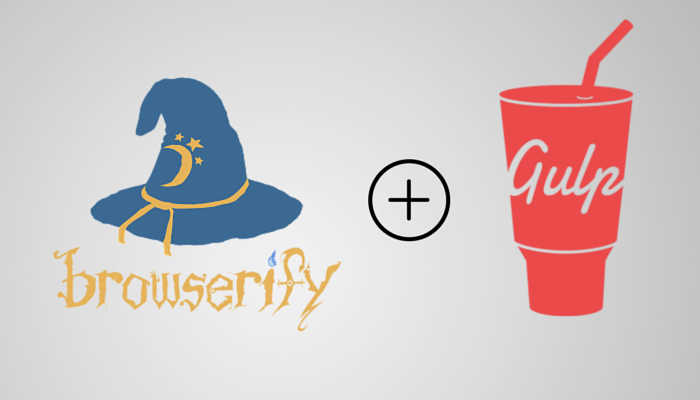
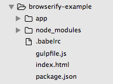
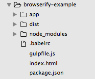

# Browserify + Gulp + Babelify



在進入第二種方法前，首先先介紹一下會用到 [Browserify](http://browserify.org/)、[Gulp](http://gulpjs.com/)、[Babelify](https://github.com/babel/babelify) 三種前端開發常會用到的工具：

[Browserify](http://browserify.org/)
- 如同官網上說明的：`Browserify lets you require('modules') in the browser by bundling up all of your dependencies.
`，Browserify 是一個可以讓你在瀏覽器端也能使用像 Node 用的 [CommonJS](https://en.wikipedia.org/wiki/CommonJS) 規範一樣，用輸出（export）和引用（require）來管理模組。此外，也能使用許多在 NPM 中的模組

[Gulp](http://gulpjs.com/)
- `Gulp` 是一個前端任務工具自動化管理工具。隨著前端工程的發展（Task Runner），我們在開發前端應用程式時有許多工作是必須重複進行，例如：打包文件、uglify、將 LESS 轉譯成一般的 CSS 的檔案，轉譯 ES6 語法等工作。若是使用一般手動的方式，往往會造成效率的低下，所以透過像是 [Grunt](http://gruntjs.com/)、Gulp 這類的 Task Runner 不但可以提昇效率，也可以更方便管理這些任務。由於 Gulp 是透過 pipeline 方式來處理檔案，在使用上比起 Grunt 的方式直觀許多，所以這邊我們主要討論的是 Gulp

[Babelify](https://github.com/babel/babelify)
- `Babelify` 是一個使用 Browserify 進行 Babel 轉換的外掛，你可以想成是一個翻譯機，可以將 React 中的 `JSX` 或 `ES6` 語法轉成瀏覽器相容的 `ES5` 語法

初步了解了三種工具的概念後，接下來我們就開始我們的環境設置：
1. 若是電腦中尚未安裝 [Node](https://zh.wikipedia.org/zh-tw/Node.js)（Node.js 是一個開放原始碼、跨平台的、可用於伺服器端和網路應用的 Google V8 引擎執行執行環境）和 NPM（Node 套件管理器 Node Package Manager。是一個以 JavaScript 編寫的軟體套件管理系統，預設環境為 Node.js，從 Node.js 0.6.3 版本開始，npm 被自動附帶在安裝包中）的話，請先 [上官網安裝](https://nodejs.org/en/)

2. 用 `npm` 安裝 `browserify`

3. 用 `npm` 安裝 `gulp`、`gulp-concat`、`gulp-html-replace`、`gulp-streamify`、`gulp-uglify`、`watchify`、`vinyl-source-stream` 開發環境用的套件（development dependencies）

	```
	// 使用 npm install --save-dev 會將安裝的套件名稱和版本存放到 package.json 的 devDependencies 欄位中
	$ npm install --save-dev gulp gulp-concat gulp-html-replace gulp-streamify gulp-uglify watchify vinyl-source-stream  
	```

3. 安裝 `babelify`、`babel-preset-es2015`、`babel-preset-react`，轉譯 `ES6` 和 `JSX` 開發環境用的套件，並於根目錄底下設定 `.babelrc`，設定轉譯規則（presets：es2015、react）和使用的外掛

	```
	// 使用 npm install --save-dev 會將安裝的套件名稱和版本存放到 package.json 的 devDependencies 欄位中
	$ npm install --save-dev babelify babel-preset-es2015 babel-preset-react
	```

	```js
    // filename: .babelrc
	{
		"presets": [
		  "es2015",
		  "react",
		],
		"plugins": []
	}
	```

4. 安裝 react 和 react-dom

	```
	$ npm install --save react react-dom
	```

6. 撰寫 Component

	```js
    // filename: ./app/index.js
	import React from 'react';
	import ReactDOM from 'react-dom';

	class App extends React.Component {
	  constructor(props) {
	    super(props);
	    this.state = {
	    };
	  }
	  render() {
	    return (
	      <div>
	        <h1>Hello, World!</h1>
	      </div>
	    );
	  }
	}

	ReactDOM.render(<App />, document.getElementById('app'));
	```

	```html
    <!-- filename: ./index.html -->
	<!DOCTYPE html>
	<html lang="en">
	<head>
		<meta charset="UTF-8">
		<title>Hello React!</title>
	</head>
	<body>
		<div id="app"></div>
		<!-- build:js -->
		<script src="./dist/src/bundle.js"></script>
		<!-- endbuild -->
	</body>
	</html>
	```

7. 設定 `gulpfile.js`

	```js
    // filename: gulpfile.js
	// 引入所有需要的檔案
	const gulp = require('gulp');
	const uglify = require('gulp-uglify');
	const htmlreplace = require('gulp-html-replace');
	const source = require('vinyl-source-stream');
	const browserify = require('browserify');
	const watchify = require('watchify');
	const babel = require('babelify');
	const streamify = require('gulp-streamify');
	// 檔案位置參數
	const path = {
	  HTML: 'index.html',
	  MINIFIED_OUT: 'bundle.min.js',
	  OUT: 'bundle.js',
	  DEST: 'dist',
	  DEST_BUILD: 'dist/build',
	  DEST_SRC: 'dist/src',
	  ENTRY_POINT: './app/index.js'
	};
	// 複製 html 到 dist 資料夾中
	gulp.task('copy', function(){
	  gulp.src(path.HTML)
	    .pipe(gulp.dest(path.DEST));
	});
	// 監聽檔案是否有變化，若有變化則重新編譯一次
	gulp.task('watch', function() {
	  gulp.watch(path.HTML, ['copy']);
	var watcher  = watchify(browserify({
	    entries: [path.ENTRY_POINT],
	    transform: [babel],
	    debug: true,
	  }));
	return watcher.on('update', function () {
	    watcher.bundle()
	      .pipe(source(path.OUT))
	      .pipe(gulp.dest(path.DEST_SRC))
	      console.log('Updated');
	  })
	    .bundle()
	    .pipe(source(path.OUT))
	    .pipe(gulp.dest(path.DEST_SRC));
	});
	// 執行 build production 的流程（包括 uglify、轉譯等）
	gulp.task('copy', function(){
	  browserify({
	    entries: [path.ENTRY_POINT],
	    transform: [babel],
	  })
	    .bundle()
	    .pipe(source(path.MINIFIED_OUT))
	    .pipe(streamify(uglify(path.MINIFIED_OUT)))
	    .pipe(gulp.dest(path.DEST_BUILD));
	});
	// 將 script 引用換成 production 的檔案
	gulp.task('replaceHTML', function(){
	  gulp.src(path.HTML)
	    .pipe(htmlreplace({
	      'js': 'build/' + path.MINIFIED_OUT
	    }))
	    .pipe(gulp.dest(path.DEST));
	});
	// 設定 NODE_ENV 為 production
	gulp.task('apply-prod-environment', function() {
	    process.env.NODE_ENV = 'production';
	});

	// 若直接執行 gulp 會執行 gulp default 的任務：watch、copy。若跑 gulp production，則會執行 build、replaceHTML、apply-prod-environment
	gulp.task('production', ['build', 'replaceHTML', 'apply-prod-environment']);
	gulp.task('default', ['watch', 'copy']);
	```

8. 成果展示
	到目前為止我們的資料夾的結構應該會是這樣：

	

	接下來我們透過在終端機（terminal）下 `gulp` 指令來處理我們設定好的任務：

	```
	// 當只有輸入 gulp 沒有輸入任務名稱時，gulp 會自動執行 default 的任務，我們這邊會執行 `watch` 和 `copy` 的任務，前者會監聽 `./app/index.js` 是否有改變，有的話則更新。後者則是會把 `index.html` 複製到 `./dist/index.html`
	$ gulp
	```

	當執行完 `gulp` 後，我們可以發現多了一個 `dist` 資料夾

	

	如果我們是要進行 `production` 的應用程式開發的話，我們可以執行： 

	```
	// 當輸入 gulp production 時，gulp 會執行 production 的任務，我們這邊會執行 `replaceHTML`、`build` 和 `apply-prod-environment` 的任務，`build` 任務會進行轉譯和 `uglify`。`replaceHTML` 會取代 `index.html` 註解中的 `<script>` 引入檔案，變成引入壓縮和 `uglify` 後的 `./dist/build/bundle.min.js`。`apply-prod-environment` 則是會更改 `NODE_ENV` 變數，讓環境設定改為 `production`，有興趣的讀者可以參考[React 官網說明](https://facebook.github.io/react/downloads.html)
	$ gulp production
	```

	此時我們可以在瀏覽器上打開我們的 `./dist/hello.html`，就可以看到 `Hello, world!` 了！

(image via [srinisoundar](https://cdn-images-1.medium.com/max/477/1*qhI4E_g3TDOK0uu1VAJlCQ.png)、[sitepoint](https://d2sis3lil8ndrq.cloudfront.net/screencasts/46e215cd-2eb3-4cf0-b699-713977a2b644.png)、[keyholesoftware](https://keyholesoftware.com/wp-content/uploads/Browserify-5.png)、[survivejs](http://survivejs.com/webpack/images/webpack.png))

## :door: 任意門
| [回首頁](https://github.com/kdchang/reactjs101) | 

| [勘誤、提問或許願](https://github.com/kdchang/reactjs101/issues) |
