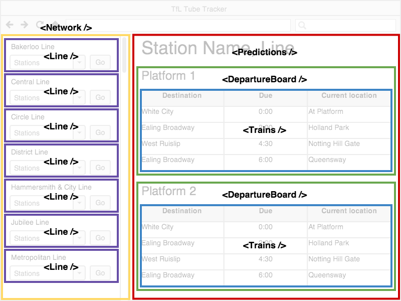

# ReactJS 與 Component 設計入門介紹

## 前言
在上一個章節中我們快速學習了 React 開發環境建置和 Webpack 入門。接下來我們將更進一步了解 React 和 Component 設計時需注意的幾個重要特性。

## ReactJS 特性簡介
React 原本是 Facebook 自己內部使用的開發工具，但卻是一個目標遠大的一個專案：`Learn once, write anywhere`。自從 2013 年開源後周邊的生態系更是蓬勃發展。ReactJS 的出現讓前端開發有許多革新性的思維出現，其中有幾個重要特性值得我們去探討：

1. 基於元件（Component）化思考
2. 用 JSX 進行宣告式（Declarative）UI 設計
3. 使用 Virtual DOM
4. Component PropType 防呆機制
5. Component 就像個狀態機（State Machine），而且也有生命週期（Life Cycle）
6. 一律重繪（Always Redraw）和單向資料流（Unidirectional Data Flow）
7. 在 JavaScript 裡寫 CSS：Inline Style 

## 基於元件（Component）化思考



在 React 的世界中最基本的單元為元件（Component），每個元件也可以包含一個以上的子元件，並依照需求組裝成一個組合式的（Composable）元件，因此具有封裝（encapsulation）、關注點分離 (Separation of Concerns)、複用 (Reuse) 、組合 (Compose) 等特性。

`<TodoApp>` 元件可以包含 `<TodoHeader />`、`<TodoList />` 子元件
```javascript
	<div>
		<TodoHeader />
		<TodoList />
	</div>
```

`<TodoList />` 元件內部長相：
```javascript
	<div>
		<ul>
			<li>寫程式碼</li>
			<li>哄妹子</li>
			<li>買書</li>
		</ul>
	</div>
```

元件化一直是網頁前端開發的聖杯，許多開發者最希望的就是可以最大化重複使用（reuse）過去所寫的程式碼，不要重複造輪子（DRY）。在 React 中元件是一切的基礎，讓開發應用程式就好像在堆積木一樣。然而對於過去習慣模版式（template）開發的前端工程師來說，短時間要轉換成元件化思考模式並不容易，尤其過去我們往往習慣於將 HTML、CSS 和 JavaScript 分離，現在卻要把它們都封裝在一起。

一個比較好的方式就是訓練自己看到不同的網頁或應用程式時，強迫自己將看到的頁面切成一個個元件。相信過了一段時間後，天眼開了，就比較容易習慣元件化的思考方式。

以下是一般 React Component 撰寫的主要兩種方式：

1. 使用 ES6 的 Class（可以進行比較複雜的操作和元件生命週期的控制，相對於 stateless components 耗費資源）

	```javascript
	//  注意元件開頭第一個字母都要大寫
	class MyComponent extends React.Component {
		// render 是 Class based 元件唯一必須的方法（method）
		render() {
			return (
				<div>Hello, World!</div>
			);
		}
	}

	// 將 <MyComponent /> 元件插入 id 為 app 的 DOM 元素中
	ReactDOM.render(<MyComponent/>, document.getElementById('app'));
	```

2. 使用 Functional Component 寫法（單純地 render UI 的 stateless components，沒有內部狀態、沒有實作物件和 ref，沒有生命週期函數。若非需要控制生命週期的話建議多使用 stateless components 獲得比較好的效能）

	```javascript
	// 使用 arrow function 來設計 Functional Component 讓 UI 設計更單純（f(D) => UI），減少副作用（side effect）
	const MyComponent = () => (
		<div>Hello, World!</div>
	);
	
	// 將 <MyComponent /> 元件插入 id 為 app 的 DOM 元素中
	ReactDOM.render(<MyComponent/>, document.getElementById('app'));
	```

## 用 JSX 進行宣告式（Declarative）UI 設計
React 在設計上的思路認為使用 Component 比起模版（Template）和顯示邏輯（Display Logic）更能實現關注點分離的概念，而搭配 JSX 可以實現聲明式 Declarative（注重 what to），而非命令式 Imperative（注重 how to）的程式撰寫方式。

像下述的宣告式（Declarative）UI 設計就比單純用（Template）式的方式更易懂：

```javascript
// 使用宣告式（Declarative）UI 設計很容易可以看出這個元件的功能
<MailForm />
```

```javascript
// <MailForm /> 內部長相
<form>
	<input type="text" name="email" />
	<button type="submit"></button>
</form>
```

由於 JSX 在 React 元件撰寫上扮演很重要的角色，因此在下一個章節我們也將更深入講解 JSX 使用細節。 

## 使用 Virtual DOM
在傳統 Web 中一般是使用 jQuery 進行 DOM 的直接操作。然而更改 DOM 往往是 Web 效能的瓶頸，因此在 React 世界設計有 Virtual DOM 的機制，讓 App 和 DOM 之間用 Virtual DOM 進行溝通。當更改 DOM 時，會透過 React 自身的 diff 演算法去計算出最小更新，進而去最小化更新真實的 DOM。

## Component PropType 防呆機制
在 React 設計時除了提供 props 預設值設定（Default Prop Values）外，也提供了 Prop 的驗證（Validation）機制，讓整個 Component 設計更加穩健：

```javascript
//  注意元件開頭第一個字母都要大寫
class MyComponent extends React.Component {
	// render 是 Class based 元件唯一必須的方法（method）
	render() {
		return (
			<div>Hello, World!</div>
		);
	}
}

// PropTypes 驗證，若傳入的 props type 不符合將會顯示錯誤
MyComponent.propTypes = {
  todo: React.PropTypes.object,
  name: React.PropTypes.string,
}

// Prop 預設值，若對應 props 沒傳入值將會使用 default 值
MyComponent.defaultProps = {
 todo: {}, 
 name: '', 
}
```

關於更多的 Validation 用法可以參考[官方網站](https://facebook.github.io/react/docs/reusable-components.html) 的說明。

## Component 就像個狀態機（State Machine），而且也有生命週期（Life Cycle）
Component 就像個狀態機（State Machine），根據不同的 state（透過 `setState()` 修改）和 props（由父元素傳入），Component 會出現對應的顯示結果。而人有生老病死，元件也有生命週期。透過操作生命週期處理函數，可以在對應的時間點進行 Component 需要的處理，關於更詳細的元件生命週期介紹我們會再下一個章節進行更一步說明。

## 一律重繪（Always Redraw）和單向資料流（Unidirectional Data Flow）
在 React 世界中，props 和 state 是影響 React Component 長相的重要要素。其中 props 都是由父元素所傳進來，不能更改，若要更改 props 則必須由父元素進行更改。而 state 則是根據使用者互動而產生的不同狀態，主要是透過 setState() 方法進行修改。當 React 發現 props 或是 state 更新時，就會重繪整個 UI。當然你也可以使用 forceUpdate() 去強迫重繪 Component。而 React 透過整合 Flux 或 Flux-like（例如：Redux）可以更具體實現單向資料流（Unidirectional Data Flow），讓資料流的管理更為清晰。

## 在 JavaScript 裡寫 CSS：Inline Style 
在 React Component 中 CSS 使用 Inline Style 寫法，全都封裝在 JavaScript 當中：

```javascript
const divStyle = {
  color: 'red',
  backgroundImage: 'url(' + imgUrl + ')',
};

ReactDOM.render(<div style={divStyle}>Hello World!</div>, document.getElementById('app'));
```

## 總結
以上介紹了 ReactJS 的幾個重要特性：

1. 基於元件（Component）化思考
2. 用 JSX 進行宣告式（Declarative）UI 設計
3. 使用 Virtual DOM
4. Component PropType 防呆機制
5. Component 就像個狀態機（State Machine），而且也有生命週期（Life Cycle）
6. 一律重繪（Always Redraw）和單向資料流（Unidirectional Data Flow）
7. 在 JavaScript 裡寫 CSS：Inline Style

接下來我們將進一步探討 React 裡 JSX 的使用方式。

## 延伸閱讀
1. [React 入门实例教程](http://www.ruanyifeng.com/blog/2015/03/react.html)
2. [React Demystified](http://blog.reverberate.org/2014/02/react-demystified.html)
3. [Top-Level API](https://facebook.github.io/react/docs/top-level-api.html)
4. [ES6 Classes Component](https://facebook.github.io/react/docs/reusable-components.html#es6-classes)

（image via [maketea](http://maketea.co.uk/images/2014-03-05-robust-web-apps-with-react-part-1/wireframe_deconstructed.png)）

## :door: 任意門
| [回首頁](https://github.com/kdchang/reactjs101) | [上一章：React 開發環境設置與 Webpack 入門教學](https://github.com/kdchang/reactjs101/blob/master/Ch02/webpack-dev-enviroment.md) | [下一章：JSX 簡明入門教學指南](https://github.com/kdchang/reactjs101/blob/master/Ch03/react-jsx-introduction.md) |

| [勘誤、提問或許願](https://github.com/kdchang/reactjs101/issues) |
