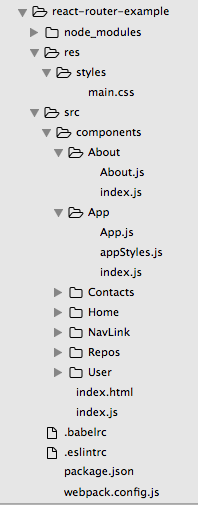
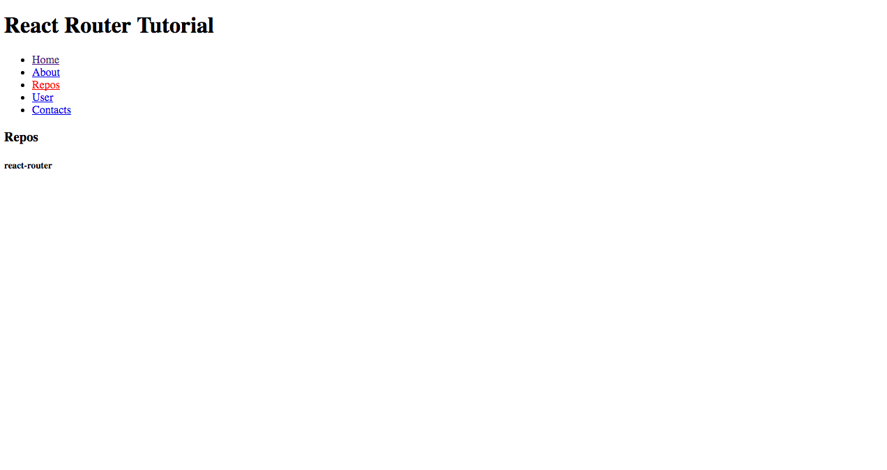

# React Router 入門實戰教學


## 前言
若你是從一開始一路走到這裡讀者請先給自己一個愛的鼓勵吧！在經歷了 React 基礎的訓練後，相信各位讀者應該都等不及想大展拳腳了！接下來我們將進行比較複雜的應用程式開發並和讀者介紹目前市場上常見的不刷頁單頁式應用程式（single page application）的設計方式。

## 單頁式應用程式（single page application）
傳統的 Web 開發主要是由伺服器管理 URL Routing 和渲染 HTML 頁面，過往每次 URL 一換或使用者連結一點，就需要重新從伺服器端重新載入頁面。但隨著使用者對於使用者體驗的要求提昇，許多的網頁應用程式紛紛設計成不刷頁的單頁式應用程式（single page application），由前端負責 URL 的 routing 管理，若需要和後端進行 API 資料溝通的話，通常也會使用 Ajax 的技術。在 React 開發世界中主流是使用 [react-router](https://github.com/reactjs/react-router) 這個 routing 管理用的 library。

## React Router 環境設置

先透過以下指令在根目錄產生 npm 設定檔 `package.json` ：

```
$ npm init
```

安裝相關套件（包含開發環境使用的套件）：

```shell
$ npm install --save react react-dom react-router
```

```
$ npm install --save-dev babel-core babel-eslint babel-loader babel-preset-es2015 babel-preset-react eslint eslint-config-airbnb eslint-loader eslint-plugin-import eslint-plugin-jsx-a11y eslint-plugin-react webpack webpack-dev-server html-webpack-plugin
```

安裝好後我們可以設計一下我們的資料夾結構，首先我們在根目錄建立 `src` 和 `res` 資料夾，分別放置 `script` 的 `source` 和靜態資源（如：全域使用的 `.css` 和圖檔）。在 `components` 資料夾中我們會放置所有 `components`（個別元件資料夾中會用 `index.js` 輸出元件，讓引入元件更簡潔），其餘設定檔則放置於根目錄下。



接下來我們先設定一下開發文檔。

1. 設定 Babel 的設定檔： `.babelrc`

	```javascript
	{
		"presets": [
	  	"es2015",
	  	"react",
	 	],
		"plugins": []
	}

	```

2. 設定 ESLint 的設定檔和規則： `.eslintrc`

	```javascript
	{
	  "extends": "airbnb",
	  "rules": {
	    "react/jsx-filename-extension": [1, { "extensions": [".js", ".jsx"] }],
	  },
	  "env" :{
	    "browser": true,
	  }
	}
	```

3. 設定 Webpack 設定檔： `webpack.config.js`

	```javascript
	// 讓你可以動態插入 bundle 好的 .js 檔到 .index.html
	const HtmlWebpackPlugin = require('html-webpack-plugin');

	const HTMLWebpackPluginConfig = new HtmlWebpackPlugin({
	  template: `${__dirname}/src/index.html`,
	  filename: 'index.html',
	  inject: 'body',
	});
	
	// entry 為進入點，output 為進行完 eslint、babel loader 轉譯後的檔案位置
	module.exports = {
	  entry: [
	    './src/index.js',
	  ],
	  output: {
	    path: `${__dirname}/dist`,
	    filename: 'index_bundle.js',
	  },
	  module: {
	    preLoaders: [
	      {
	        test: /\.jsx$|\.js$/,
	        loader: 'eslint-loader',
	        include: `${__dirname}/src`,
	        exclude: /bundle\.js$/
	      }
	    ],
	    loaders: [{
	      test: /\.js$/,
	      exclude: /node_modules/,
	      loader: 'babel-loader',
	      query: {
	        presets: ['es2015', 'react'],
	      },
	    }],
	  },
	  // 啟動開發測試用 server 設定（不能用在 production）
	  devServer: {
	    inline: true,
	    port: 8008,
	  },
	  plugins: [HTMLWebpackPluginConfig],
	};
	```

太好了！這樣我們就完成了開發環境的設定可以開始動手實作 `React Router` 應用程式了！	

## 開始 React Routing 之旅

HTML Markup：

```html
<!DOCTYPE html>
<html lang="en">
<head>
  <meta charset="UTF-8">
  <title>ReactRouter</title>
  <link rel="stylesheet" type="text/css" href="../res/styles/main.css">
</head>
<body>
	<div id="app"></div>
</body>
</html>
```

以下是 `webpack.config.js` 的進入點 `src/index.js`，負責管理 `Router` 和 `render` 元件。這邊我們要先詳細討論的是，為了使用 React Router 功能引入了許多 `react-router` 內部的元件。

1. Router
`Router` 是放置 Route 的容器，其本身不定義 routing ，真正 routing 規則由 `Route` 定義。

2. Route
`Route` 負責 URL 和對應的元件關係，可以有多個 `Route` 規則也可以有嵌套（nested）`Routing`。像下面的例子就是每個頁面都會先載入 `App` 元件再載入對應 URL 的元件。

3. history
`Router` 中有一個屬性 `history` 的規則，這邊使用我們使用 `hashHistory`，使用 routing 將由 `hash`（#）變化決定。例如：當使用者拜訪 `http://www.github.com/`，實際看到的會是 `http://www.github.com/#/`。下列範例若是拜訪了 `/about` 則會看到 `http://localhost:8008/#/about` 並載入 `App` 元件再載入 `About` 元件。

	- hashHistory
	教學範例使用的，會通過 `hash` 進行對應。好處是簡單易用，不用多餘設定。

	- browserHistory
	適用於伺服器端渲染，但需要設定伺服器端避免處理錯誤，這部份我們會在後面的章節詳細說明。注意的是若是使用 Webpack 開發用伺服器需加上 `--history-api-fallback`

	```
	$ webpack-dev-server --inline --content-base . --history-api-fallback
	```

	- createMemoryHistory
	主要用於伺服器渲染，使用上會建立一個存在記憶體的 `history` 物件，不會修改瀏覽器的網址位置。

	```
	const history = createMemoryHistory(location)
	```

4. path
`path` 是對應 URL 的規則。例如：`/repos/torvalds` 會對應到 `/repos/:name` 的位置，並將參數傳入 `Repos` 元件中。由 `this.props.params.name` 取得參數。順帶一提，若為查詢參數 `/user?q=torvalds` 則由 `this.props.location.query.q` 取得參數。

5. IndexRoute
由於 `/` 情況下 App 元件對應的 `this.props.children` 會是 `undefinded`，所以使用 `IndexRoute` 來解決對應問題。這樣當 URL 為 `/` 時將會對應到 Home 元件。不過要注意的是 `IndexRoute` 沒有 path 屬性。

```javascript
import React from 'react';
import ReactDOM from 'react-dom';
import { Router, Route, hashHistory, IndexRoute } from 'react-router';
import App from './components/App';
import Home from './components/Home';
import Repos from './components/Repos';
import About from './components/About';
import User from './components/User';
import Contacts from './components/Contacts';

ReactDOM.render(
  <Router history={hashHistory}>
    <Route path="/" component={App}>
      <IndexRoute component={Home} />
      <Route path="/repos/:name" component={Repos} />
      <Route path="/about" component={About} />
      <Route path="/user" component={User} />
      <Route path="/contacts" component={Contacts} />
    </Route>
  </Router>,
  document.getElementById('app'));

  /* 另外一種寫法：
	const routes = (
	    <Route path="/" component={App}>
	      <IndexRoute component={Home} />
	      <Route path="/repos/:name" component={Repos} />
	      <Route path="/about" component={About} />
	      <Route path="/user" component={User} />
	      <Route path="/contacts" component={Contacts} />
	    </Route>
	);

	ReactDOM.render(
	  <Router routes={routes} history={hashHistory} />,
	  document.getElementById('app'));
  */
```

由於我們在 `index.js` 使用嵌套 routing，把 App 元件當做每個元件都會載入的母模版，亦即進入每個對應頁面載入對應元件前都會先載入 App 元件。這樣就可以讓每個頁面都有導覽列連結可以點選，同時可以透過 `props.children` 載入對應 URL 的子元件。

1. Link
`Link` 元件主要用於點擊後連結轉換，可以想成是 `<a>` 超連結的 React 版本。若是希望當點擊時候有對應的 css style，可以使用 `activeStyle`、`activeClassName` 去做設定。範例分別使用於 `index.html`使用傳統 `CSS` 載入、Inline Style、外部引入 `Inline Style` 寫法。

2. IndexLink
IndexLink 主要是了處理 `index` 用途，特別注意當 child route `actived` 時，parent route 也會 `actived`。所以我們回首頁的連結使用 `<IndexLink />` 內部的 `onlyActiveOnIndex` 屬性來解決這個問題。

3. Redirect、IndexRedirect
這邊雖然沒有用到，但若讀者有需要使用到連結跳轉的話可以參考這兩個元件，用法類似於 `Route` 和 `IndexRedirect`。

以下是 `src/components/App/App.js` 完整程式碼：

```javascript
import React from 'react';
import { Link, IndexLink } from 'react-router';
import styles from './appStyles';
import NavLink from '../NavLink';

const App = (props) => (
  <div>
    <h1>React Router Tutorial</h1>
    <ul>
      <li><IndexLink to="/" activeClassName="active">Home</IndexLink></li>
      <li><Link to="/about" activeStyle={{ color: 'green' }}>About</Link></li>
      <li><Link to="/repos/react-router" activeStyle={styles.active}>Repos</Link></li>
      <li><Link to="/user" activeClassName="active">User</Link></li>
      <li><NavLink to="/contacts">Contacts</NavLink></li>
    </ul>
    <!-- 我們將 App 元件當做每個元件都會載入的母模版，因此可以透過 children 載入對應 URL 的子元件 -->
    {props.children}
  </div>
);

App.propTypes = {
  children: React.PropTypes.object,
};

export default App;
```

對應的元件內部使用 Functional Component 進行 UI 渲染：

以下是 `src/components/Repos/Repos.js` 完整程式碼：

```javascript
import React from 'react';

const Repos = (props) => (
  <div>
    <h3>Repos</h3>
    <h5>{props.params.name}</h5>
  </div>
);

Repos.propTypes = {
  params: React.PropTypes.object,
};

export default Repos;
```

詳細的程式碼讀者可以參考範例資料夾，若讀者跟著範例完成的話，可以在終端機上執行 `npm start`，並於瀏覽器 `http://localhost:8008`看到以下成果，當你點選連結時會切換對應元件並改變 `actived` 狀態！



## 總結
到這邊我們又一起完成了一個重要的一關，學習 `routing` 對於使用 `React` 開發複雜應用程式是非常重要的一步，接下來我們將一起學習一個相對獨立的單元 `ImmutableJS`，但學習 `ImmutableJS` 可以讓我們在使用 `React` 和 `Flux/Redux` 可以有更好的效能和避免一些副作用。

## 延伸閱讀
1. [Leveling Up With React: React Router](https://css-tricks.com/learning-react-router/)
2. [Programmatically navigate using react router](http://stackoverflow.com/questions/31079081/programmatically-navigate-using-react-router)
3. [React Router 使用教程](http://www.ruanyifeng.com/blog/2016/05/react_router.html)
4. [React Router 中文文档](https://react-guide.github.io/react-router-cn/index.html)
5. [React Router Tutorial](https://github.com/reactjs/react-router-tutorial)

（iamge via [seanamarasinghe](http://seanamarasinghe.com/wp-content/uploads/2016/01/react-router-1050x360.jpg)）

## 任意門
| [回首頁](https://github.com/kdchang/reactjs101) | [上一章：React Component 規格與生命週期（Life Cycle）](https://github.com/kdchang/reactjs101/blob/master/Ch04/react-component-life-cycle.md) | [下一章：ImmutableJS 入門教學](https://github.com/kdchang/reactjs101/blob/master/Ch06/react-immutable-introduction.md) |

| [勘誤、提問或許願](https://github.com/kdchang/reactjs101/issues) |
