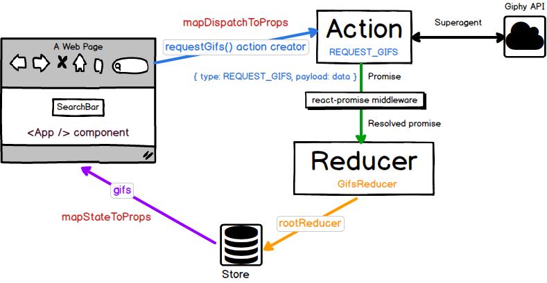

# Redux 基礎概念


## 前言
前面一個章節我們講解了 Flux 的功能和用法，但在實務上許多開發者較偏好的是同為 Flux-like 但較為簡潔且文件豐富清楚的 [Redux](http://redux.js.org/index.html) 當作狀態資料管理的架構。Redux 是由 Dan Abramov 所發起的一個開源的 library，其主要功能如官方首頁寫著：`Redux is a predictable state container for JavaScript apps.`，亦即 Redux 希望能提供一個可以預測的 state 管理容器，讓開發者可以可以更容易開發複雜的 JavaScript 應用程式（注意 Redux 和 React 並無相依性，只是和 React 可以有很好的整合）。

## Flux/Redux 超級比一比

從簡單 Flux/Redux 比較圖可以看出兩者之間有些差異：


在開始實作 Redux App 之前我們先來了解一下 Redux 和 Flux 的一些差異：

1. 只使用一個 store 將整個應用程式的狀態 (state) 用物件樹 (object tree) 的方式儲存起來：

	原生的 Flux 會有許多分散的 store 儲存各個不同的狀態，但在 redux 中，只會有唯一一個 store 將所有的資料用物件的方式包起來。

	```javascript
	//原生 Flux 的 store
	const userStore = {
	    name: ''
	}
	const todoStore = {
	    text: ''
	}

	// Redux 的單一 store
	const state = {
	    userState: {
	        name: ''
	    },
	    todoState: {
	        text: ''
	    }
	}
	```

2. 唯一可以改變 state 的方法就是發送 action，這部份和 Flux 類似，但 Redux 並沒有像 Flux 設計有 Dispatcher。Redux 的 action 和 Flux 的 action 都是一個包含 `type` 和 `payload` 的物件。

3. Redux 擁有 Flux 所沒有的 Reducer。Reducer 根據 action 的 type 去執行對應的 state 做變化的函式叫做 Reducer。你可以使用 switch 或是使用函式 mapping 的方式去對應處理的方式。 

4. Redux 擁有許多方便好用的輔助測試工具（例如：[redux-devtools](https://github.com/gaearon/redux-devtools)、[react-transform-boilerplate](https://github.com/gaearon/react-transform-boilerplate)），方便測試和使用 `Hot Module Reload`。

## Redux 核心概念介紹


從上述的圖中我們可以看到 Redux 資料流的模型大致上可以簡化成： `View -> Action -> (Middleware) -> Reducer`。當使用者和 View 互動時會觸發事件發出 Action，若有使用 Middleware 的話會在進入 Reducer 進行一些處理，當 Action 進到 Reducer 時，Reducer 會根據，action type 去 mapping 對應處理的動作，然後回傳回新的 state。View 則因為偵測到 state 更新而重繪頁面。在這個章節我們討論的是 synchronous（同步）的情形，asynchronous（非同步）的狀況會在接下來的章節進行討論。以下就用官方網站上的簡單範例來讓大家感受一下 Redux 的整個使用流程：

```javascript
import { createStore } from 'redux';

/** 
  下面是一個簡單的 reducers ，主要功能是針對傳進來的 action type 判斷並回傳新的 state
  reducer 規格：(state, action) => newState 
  一般而言 state 可以是 primitive、array 或 object 甚至是 ImmutableJS Data。但要留意的是不能修改到原來的 state ，
  回傳的是新的 state。由於使用在 Redux 中使用 ImmutableJS 有許多好處，所以我們的範例 App 也會使用 ImmutableJS 
*/
function counter(state = 0, action) {
  switch (action.type) {
  case 'INCREMENT':
    return state + 1;
  case 'DECREMENT':
    return state - 1;
  default:
    return state;
  }
}

// 創建 Redux store 去存放 App 的所有 state
// store 的可用 API { subscribe, dispatch, getState } 
let store = createStore(counter);

// 可以使用 subscribe() 來訂閱 state 是否更新。但實務通常會使用 react-redux 來串連 React 和 Redux
store.subscribe(() =>
  console.log(store.getState());
);

// 若想改變 state ，一律發 action
store.dispatch({ type: 'INCREMENT' });
// 1
store.dispatch({ type: 'INCREMENT' });
// 2
store.dispatch({ type: 'DECREMENT' });
// 1
```

## Redux API 入門

1. createStore：`createStore(reducer, [preloadedState], [enhancer])`

	我們知道在 Redux 中只會有一個 store。在產生 store 時我們會使用 `createStore` 這個 API 來創建 store。第一個參數放入我們的 `reducer` 或是有多個 `reducers` combine（使用 `combineReducers`）在一起的 `rootReducers`。第二個參數我們會放入希望預先載入的 `state` 例如：user session 等。第三個參數通常會放入我們想要使用用來增強 Redux 功能的 `middlewares`，若有多個 `middlewares` 的話，通常會使用 `applyMiddleware` 來整合。

2. Store

	屬於 Store 的四個方法：

	- getState()
	- dispatch(action)
	- subscribe(listener)
	- replaceReducer(nextReducer)

	關於 Store 重點是要知道 Redux 只有一個 Store 負責存放整個 App 的 State，而唯一能改變 State 的方法只有發送 action。

3. combineReducers：`combineReducers(reducers)`

	combineReducers 可以將多個 reducers 進行整合並回傳一個 Function，讓我們可以將 reducer 適度分割

4. applyMiddleware：`applyMiddleware(...middlewares)`	

	官方針對 Middleware 進行說明
	> It provides a third-party extension point between dispatching an
	action, and the moment it reaches the reducer.
		
	若有 NodeJS 的經驗的讀者，對於 middleware 概念應該不陌生，讓開發者可以在 req 和 res 之間進行一些操作。在 Redux 中 Middleware 則是扮演 action 到達 reducer 前的第三方擴充。而 applyMiddleware 可以將多個 `middlewares` 整合並回傳一個 Function，便於使用。

	若是你要使用 asynchronous（非同步）的行為的話需要使用其中一種 middleware： [redux-thunk](https://github.com/gaearon/redux-thunk)、[redux-promise](https://github.com/acdlite/redux-promise) 或 [redux-promise-middleware](https://github.com/pburtchaell/redux-promise-middleware) ，這樣可以讓你在 actions 中 dispatch Promises 而非 function。asynchronous（非同步）運作方式就如同下圖所示：

	

5. bindActionCreators：`bindActionCreators(actionCreators, dispatch)`

	bindActionCreators 可以將 `actionCreators` 和 `dispatch` 綁定，並回傳一個 Function 或 Object，讓程式更簡潔。但若是使用 react-redux 可以用 `connect` 讓 dispatch 行為更容易管理

6. compose：`compose(...functions)`
	
	compose 可以將 function 由右到左合併並回傳一個 Function，如官網範例所示：

	```
	import { createStore, combineReducers, applyMiddleware, compose } from 'redux'
	import thunk from 'redux-thunk'
	import DevTools from './containers/DevTools'
	import reducer from '../reducers/index'

	const store = createStore(
	  reducer,
	  compose(
	    applyMiddleware(thunk),
	    DevTools.instrument()
	  )
	)
	```

## 總結
以上介紹了 Redux 的基礎概念，若是讀者覺得還是有點抽象的話也沒關係，在下一個章節我們將實際帶大家開發一個整合 `React`、`Redux` 和 `ImmutableJS` 的 TodoApp。

## 延伸閱讀
1. [Redux 官方網站](http://redux.js.org/index.html)
2. [Redux架构实践——Single Source of Truth](http://react-china.org/t/redux-single-source-of-truth/5564)
3. [Presentational and Container Components](https://medium.com/@dan_abramov/smart-and-dumb-components-7ca2f9a7c7d0)
4. [使用Redux管理你的React应用](https://github.com/matthew-sun/blog/issues/18)
5. [Using redux](http://www.slideshare.net/JonasOhlsson/using-redux)

（image via [githubusercontent](https://raw.githubusercontent.com/reactjs/redux/master/logo/logo-title-dark.png)、[makeitopen](http://makeitopen.com/static/images/redux_flowchart.png)、[css-tricks](https://css-tricks.com/wp-content/uploads/2016/03/redux-article-3-03.svg)、[tighten](https://blog.tighten.co/assets/img/react-redux-diagram.png)、[tryolabs](http://blog.tryolabs.com/wp-content/uploads/2016/04/redux-simple-f8-diagram.png)、[facebook](https://facebook.github.io/flux/img/flux-simple-f8-diagram-with-client-action-1300w.png)、[JonasOhlsson](http://www.slideshare.net/JonasOhlsson/using-redux)）

## :door: 任意門
| [回首頁](https://github.com/kdchang/reactjs101) | [上一章：Flux 基礎概念與實戰入門](https://github.com/kdchang/reactjs101/blob/master/Ch07/react-flux-introduction.md) | [下一章：Redux 實戰入門](https://github.com/kdchang/reactjs101/blob/master/Ch07/react-redux-real-world-example.md) |

| [勘誤、提問或許願](https://github.com/kdchang/reactjs101/issues) |
