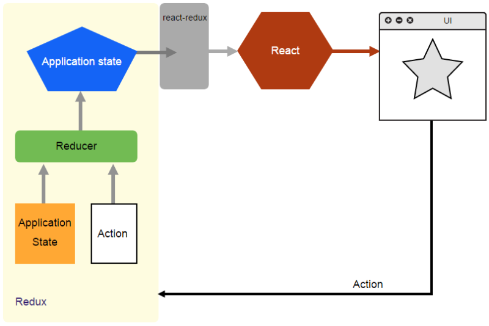
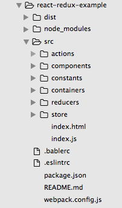
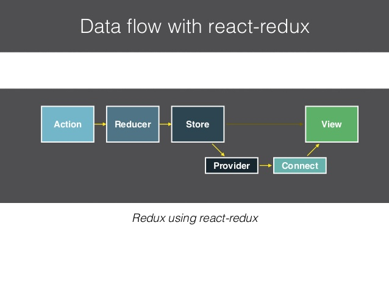
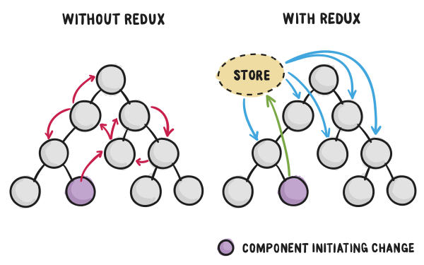
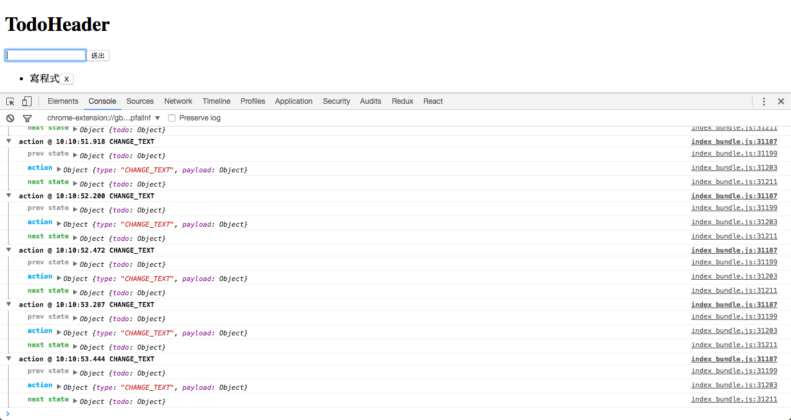

# Redux 實戰入門

## 前言
上一節我們了解了 Redux 基本的概念和特性後，本章我們要實際動手用 Redux、React Redux 結合 ImmutableJS 開發一個簡單的 Todo 應用。話不多說，那就讓讓我們開始吧！

以下這張圖表示了整個 React Redux App 的資料流程圖（使用者與 View 互動 => dispatch 出 Action => Reducers 依據 action tyoe 分配到對應處理方式，回傳新的 state => 透過 React Redux 傳送給 React，React 重新繪製 View）：



## 動手創作 React Redux ImmutableJS TodoApp
在開始創作之前我們先完成一些開發的前置作業，先透過以下指令在根目錄產生 npm 設定檔 `package.json`：

```
$ npm init
```

安裝相關套件（包含開發環境使用的套件）：

```
$ npm install --save react react-dom redux react-redux immutable redux-actions redux-immutable
```

```
$ npm install --save-dev babel-core babel-eslint babel-loader babel-preset-es2015 babel-preset-react eslint eslint-config-airbnb eslint-loader eslint-plugin-import eslint-plugin-jsx-a11y eslint-plugin-react html-webpack-plugin webpack webpack-dev-server
```

安裝好後我們可以設計一下我們的資料夾結構，首先我們在根目錄建立 `src`，放置 `script` 的 `source` 。在 `components` 資料夾中我們會放置所有 `components`（個別元件資料夾中會用 `index.js` 輸出元件，讓引入元件更簡潔）、`containers`（負責和 store 互動取得 state），另外還有 `actions`、`constants`、`reducers`、`store`，其餘設定檔則放置於根目錄下。

大致上的資料夾結構會長這樣：



接下來我們參考上一章設定一下開發文檔（`.babelrc`、`.eslintrc`、`webpack.config.js`）。這樣我們就完成了開發環境的設定可以開始動手實作 `React Redux` 應用程式了！

首先我們先用 Component 之眼感受一下我們應用程式，將它切成一個個 `Component`。在這邊我們設計一個主要的 `Main` 包含兩個子 Component：`TodoHeader`、`TodoList`。


首先設計 HTML Markup：

```html
<!DOCTYPE html>
<html lang="en">
<head>
	<meta charset="UTF-8">
	<title>Redux Todo</title>
</head>
<body>
	<div id="app"></div>
</body>
</html>
```

在撰寫 `src/index.js` 之前，我們先說明整合 `react-redux` 的用法。從以下這張圖可以看到 `react-redux` 是 React 和 Redux 間的橋樑，使用 `Provider`、`connect` 去連結 `store` 和 React View。



事實上，整合了 `react-redux` 後，我們的 React App 就可以解決傳統跨 Component 之前傳遞 state 的問題和困難。只要透過 `Provider` 就可以讓每個 React App 中的 `Component` 取用 store 中的 state，非常方便（接下來我們也會更詳細說明 Container/Component、`connect` 的用法）。



以下是 `src/index.js` 完整程式碼： 

```javascript
import React from 'react';
import ReactDOM from 'react-dom';
import { Provider } from 'react-redux';
import Main from './components/Main';
import store from './store';

ReactDOM.render(
  <Provider store={store}>
    <Main />
  </Provider>,
  document.getElementById('app')
);
```

其中 `src/components/Main/Main.js` 是 Stateless Component，負責所有 View 的進入點。

```javascript
import React from 'react';
import ReactDOM from 'react-dom';
import TodoHeaderContainer from '../../containers/TodoHeaderContainer';
import TodoListContainer from '../../containers/TodoListContainer';

const Main = () => (
  <div>
    <TodoHeaderContainer />
    <TodoListContainer />
  </div>
);

export default Main;
```

接下來我們定義一下 `Actions` 的部份，由於是範例 App 所以相對簡單，這邊只定義一個 todoActions。在這邊我們使用了 [redux-actions](https://github.com/acdlite/redux-actions)，它可以方便我們使用 Flux Standard Action 格式的 action。以下是 `src/actions/todoActions.js` 完整程式碼：

```javascript
import { createAction } from 'redux-actions';
import {
  CREATE_TODO,
  DELETE_TODO,
  CHANGE_TEXT,
} from '../constants/actionTypes';

export const createTodo = createAction('CREATE_TODO');
export const deleteTodo = createAction('DELETE_TODO');
export const changeText = createAction('CHANGE_TEXT');
```

我們在 `src/actions/index.js` 將所有 actions 輸出

```javascript
export * from './todoActions';
```

另外我們把 constants 放到 `components` 資料夾中方便管理，以下是 `src/constants/actionTypes.js` 程式碼：

```javascript
export const CREATE_TODO = 'CREATE_TODO';
export const DELETE_TODO = 'DELETE_TODO';
export const CHANGE_TEXT = 'CHANGE_TEXT';

/* 
或是可以考慮使用 keyMirror，方便產生與 key 相同的常數
import keyMirror from 'fbjs/lib/keyMirror';

export default keyMirror({
    ADD_ITEM: null,
    DELETE_ITEM: null,
    DELETE_ALL: null,
    FILTER_ITEM: null
});
*/
```

設定 Actions 後我們來討論一下 Reducers 的部份。在討論 Reducers 之前我們先來設定一下我們的前端的資料結構，在這邊我們把所有資料結構（initialState）放到 `src/constants/models.js` 中。這邊特別注意的是由於 Redux 中有一個重要特性是 `State is read-only`，也就是說更新當 reducers 進到 action 只會回傳新的 state 不會更改到原有的 state。因此我們會在整個 Redux App 中使用 `ImmutableJS` 讓整個資料流維持在 `Immutable` 的狀態，也可以提昇程式開發上的效能和避免不可預期的副作用。

以下是 `src/constants/models.js` 完整程式碼，其設定了 TodoState 的資料結構並使用 `fromJS()` 轉成 `Immutable`：

```javascript
import Immutable from 'immutable';

export const TodoState = Immutable.fromJS({
  'todos': [],
  'todo': {
    id: '',
    text: '',
    updatedAt: '',
    completed: false,
  }
});
```

接下來我們要討論的是 Reducers 的部份，在 `todoReducers` 中我們會根據接收到的 action 進行 mapping 到對應的處理函式並傳入夾帶的 `payload` 資料（這邊我們使用 [redux-actions](https://github.com/acdlite/redux-actions) 來進行 mapping，使用上比傳統的 switch 更為簡潔）。Reducers 接收到 action 的處理方式為 `(initialState, action) => newState`，最終會回傳一個新的 state，而非更改原來的 state，所以這邊我們使用 `ImmutableJS`。

```javascript
import { handleActions } from 'redux-actions';
import { TodoState } from '../../constants/models';

import {
  CREATE_TODO,
  DELETE_TODO,
  CHANGE_TEXT,
} from '../../constants/actionTypes';

 const todoReducers = handleActions({
  CREATE_TODO: (state) => {
    let todos = state.get('todos').push(state.get('todo'));
    return state.set('todos', todos)
  },
  DELETE_TODO: (state, { payload }) => (
    state.set('todos', state.get('todos').splice(payload.index, 1))
  ),
  CHANGE_TEXT: (state, { payload }) => (
    state.merge({ 'todo': payload })
  )
}, TodoState);

export default todoReducers;
```

```javascript
import { handleActions } from 'redux-actions';
import UiState from '../../constants/models';

export default handleActions({
  SHOW: (state, { payload }) => (
    state.set('todos', payload.todo)
  ),
}, UiState); 
```

雖然 Redux 本身僅會有一個 store，但 redux 本身有提供了 `combineReducers` 可以讓我們切割我們 state 方便維護和管理。實上，state 的規劃也是一們學問，通常需要不斷地實作和工作團隊討論才能找到比較好的方式。不過這邊要注意的是我們改使用了 `redux-immutable` 的 `combineReducers` 這樣可以確保我們的 state 維持在 `Immutable` 的狀態。		

由於 Redux 官方也沒有特別明確或嚴謹的規範。在一般情況我會將 reducers 分為 `data` 和單純和 UI 有關的 `ui` state。但由於這邊是比較簡單的例子，我們最終只使用到 `src/reducers/data/todoReducers.js`。 

```javascript
import { combineReducers } from 'redux-immutable';
import ui from './ui/uiReducers';// import routes from './routes';
import todo from './data/todoReducers';// import routes from './routes';

const rootReducer = combineReducers({
  todo,
});

export default rootReducer;
```

還記得我們上面說明 React Redux 之前的橋樑時有提到的 store 嗎？現在我們要更仔細地去設計 `store`，我們這邊使用到了 redux 其中兩個 API：applyMiddleware、createStore。分別可以產生 store 和掛載我們要使用的 middleware（這邊我們只使用到 redux-logger 方便我們除錯）。注意我們 initialState 也是維持在 `Immutable` 的狀態。	

```javascript
import { createStore, applyMiddleware } from 'redux';
import createLogger from 'redux-logger';
import Immutable from 'immutable';
import rootReducer from '../reducers';

const initialState = Immutable.Map();

export default createStore(
  rootReducer,
  initialState,
  applyMiddleware(createLogger({ stateTransformer: state => state.toJS() }))
);
```

透過 `src/store/index.js` 輸出 configureStore：

```javascript
export { default } from './configureStore';
```

講解完架構層面的議題，終於我們來到了 View 的部份。加油，距離我們終點也不遠了！
在開始討論 `Component` 的部份之前我們先來研究一下 

[react-redux](https://github.com/reactjs/react-redux) 所提供的 API `connect` 將 props 傳給 Component，其用法如下：

`connect([mapStateToProps], [mapDispatchToProps], [mergeProps], [options])` 

在我們的範例 App 中我們只會先用到前兩個參數，第三個參數會在之後的例子裡用到。第一個參數 mapStateToProps 是一個讓開發者可以從 store 取出想要 state 並當做 props 往下傳的功能，第二個參數則是將 dispatch 行為封裝成函數順著 props 可以方便往下傳和呼叫。

以下是 `src/components/TodoHeader/TodoHeader.js` 的部份：

```javascript
import React from 'react';
import ReactDOM from 'react-dom';
import { connect } from 'react-redux';
import TodoHeader from '../../components/TodoHeader';

// 將欲使用的 actions 引入
import {
  changeText,
  createTodo,
} from '../../actions';

const mapStateToProps = (state) => ({
	// 從 store 取得 todo state
	todo: state.getIn(['todo', 'todo'])
});

const mapDispatchToProps = (dispatch) => ({
	// 當使用者在 input 輸入資料值即會觸發這個函數，發出 changeText action 並附上使用者輸入內容 event.target.value
	onChangeText: (event) => (
	  dispatch(changeText({ text: event.target.value }))
	),
	// 當使用者按下送出時，發出 createTodo action 並清空 input 
	onCreateTodo: () => {
	  dispatch(createTodo());
	  dispatch(changeText({ text: '' }));
	}
});

export default connect(
	mapStateToProps,
	mapDispatchToProps,
)(TodoHeader);

// 開始建設 Component 並使用 connect 進來的 props 並綁定事件（onChange、onClick）。注意我們的 state 因為是使用 `ImmutableJS` 所以要用 `get()` 取值
const TodoHeader = ({
  onChangeText,
  onCreateTodo,
  todo,
}) => (
  <div>
    <h1>TodoHeader</h1>
    <input type="text" value={todo.get('text')} onChange={onChangeText} />
    <button onClick={onCreateTodo}>送出</button>
  </div>
);

export default TodoHeader;
```

以下是 `src/components/TodoList/TodoList.js` 的部份：

```javascript
import React from 'react';
import ReactDOM from 'react-dom';
import { connect } from 'react-redux';
import TodoList from '../../components/TodoList';

import {
  deleteTodo,
} from '../../actions';

const mapStateToProps = (state) => ({
  todos: state.getIn(['todo', 'todos'])
});

// 由 Component 傳進欲刪除元素的 index
const mapDispatchToProps = (dispatch) => ({
  onDeleteTodo: (index) => () => (
    dispatch(deleteTodo({ index }))
  )
});

export default connect(
	mapStateToProps,
	mapDispatchToProps,
)(TodoList);

// Component 部分值的注意的是 todos state 是透過 map function 去迭代出元素，由於要讓 React JSX 可以渲染並保持傳入觸發 event state 的 immutable，所以需使用 toJS() 轉換 component of array。
const TodoList = ({
  todos,
  onDeleteTodo,
}) => (
  <div>
    <ul>
    {
      todos.map((todo, index) => (
        <li key={index}>
          {todo.get('text')}
          <button onClick={onDeleteTodo(index)}>X</button>
        </li>
      )).toJS()
    }
    </ul>
  </div>
);

export default TodoList;
```

若是一切順利的話就可以在瀏覽器上看到自己努力的成果囉！（因為我們有使用 `redux-logger` 所以打開 console 會看到 action 和 state 的變化情形，但記得在 `production` 環境要拿掉）



## 總結
以上就是 Redux 實戰入門，對於第一次自己動手寫 Redux 的朋友可能會需要多練習幾次，多體會整個架構。在接下來的章節我們將優化我們的 React Redux TodoApp，讓它可以有更清晰好維護的架構。

## 延伸閱讀
1. [Redux 官方網站](http://redux.js.org/index.html)

（image via [JonasOhlsson](http://www.slideshare.net/JonasOhlsson/using-redux)、[licdn](https://media.licdn.com/mpr/mpr/shrinknp_800_800/AAEAAQAAAAAAAAUQAAAAJDAyMWU1MmZhLTYzMTQtNDJkNy1hYzM4LTE5MWQzNWM1ODcyNA.png)）

## :door: 任意門
| [回首頁](https://github.com/kdchang/reactjs101) | [上一章：Redux 基礎概念](https://github.com/kdchang/reactjs101/blob/master/Ch07/react-redux-real-world-example.md) | [下一章：Container 與 Presentational Components 入門](https://github.com/kdchang/reactjs101/blob/master/Ch08/container-presentational-component-.md) |

| [勘誤、提問或許願](https://github.com/kdchang/reactjs101/issues) |
