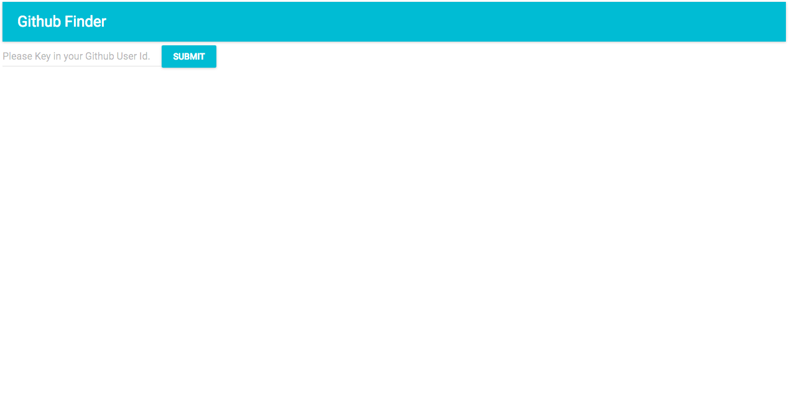
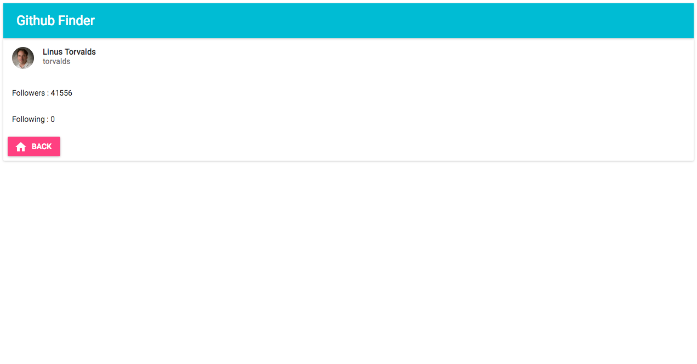

# 用 React + Router + Redux + ImmutableJS 寫一個 Github 查詢應用

## 前言
學了一身本領後，本章將帶大家完成一個單頁式應用程式（Single Page Application），整合 React + Redux + ImmutableJS + React Router 搭配 Github API 製作一個簡單的 Github 使用者查詢應用，實際體驗一下開發 React App 的感受。

## 功能規劃
讓訪客可以使用 Github ID 搜尋 Github 使用者，展示 Github 使用者名稱、follower、following、avatar_url 並可以返回首頁。

## 使用技術

1. React
2. Redux
3. Redux Thunk
4. React Router
5. ImmutableJS
6. Fetch
7. [Material UI](http://www.material-ui.com/#/)
8. Roboto Font from Google Font
9. Github API（https://api.github.com/users/torvalds）

不過要注意的是 Github API 若沒有使用 App key 的話可以呼叫 API 的次數會受限

## 專案成果截圖






## 環境安裝與設定
1. 安裝 Node 和 NPM

2. 安裝所需套件

```
$ npm install --save react react-dom redux react-redux react-router immutable redux-immutable redux-actions whatwg-fetch redux-thunk material-ui react-tap-event-plugin
```

```
$ npm install --save-dev babel-core babel-eslint babel-loader babel-preset-es2015 babel-preset-react babel-preset-stage-1 eslint eslint-config-airbnb eslint-loader eslint-plugin-import eslint-plugin-jsx-a11y eslint-plugin-react html-webpack-plugin webpack webpack-dev-server redux-logger
```

接下來我們先設定一下開發文檔。

1. 設定 Babel 的設定檔： `.babelrc`

	```javascript
	{
		"presets": [
	  	"es2015",
	  	"react",
	 	],
		"plugins": []
	}

	```

2. 設定 ESLint 的設定檔和規則： `.eslintrc`

	```javascript
	{
	  "extends": "airbnb",
	  "rules": {
	    "react/jsx-filename-extension": [1, { "extensions": [".js", ".jsx"] }],
	  },
	  "env" :{
	    "browser": true,
	  }
	}
	```

3. 設定 Webpack 設定檔： `webpack.config.js`

	```javascript
	// 讓你可以動態插入 bundle 好的 .js 檔到 .index.html
	const HtmlWebpackPlugin = require('html-webpack-plugin');

	const HTMLWebpackPluginConfig = new HtmlWebpackPlugin({
	  template: `${__dirname}/src/index.html`,
	  filename: 'index.html',
	  inject: 'body',
	});
	
	// entry 為進入點，output 為進行完 eslint、babel loader 轉譯後的檔案位置
	module.exports = {
	  entry: [
	    './src/index.js',
	  ],
	  output: {
	    path: `${__dirname}/dist`,
	    filename: 'index_bundle.js',
	  },
	  module: {
	    preLoaders: [
	      {
	        test: /\.jsx$|\.js$/,
	        loader: 'eslint-loader',
	        include: `${__dirname}/src`,
	        exclude: /bundle\.js$/
	      }
	    ],
	    loaders: [{
	      test: /\.js$/,
	      exclude: /node_modules/,
	      loader: 'babel-loader',
	      query: {
	        presets: ['es2015', 'react'],
	      },
	    }],
	  },
	  // 啟動開發測試用 server 設定（不能用在 production）
	  devServer: {
	    inline: true,
	    port: 8008,
	  },
	  plugins: [HTMLWebpackPluginConfig],
	};
	```

太好了！這樣我們就完成了開發環境的設定可以開始動手實作 `Github Finder` 應用程式了！	

## 動手實作

1. Setup Mockup

	HTML Markup（`src/index.html`）：

	```html
	<!DOCTYPE html>
	<html lang="en">
	<head>
	  <meta charset="UTF-8">
		<title>GithubFinder</title>
		<link href="https://fonts.googleapis.com/css?family=Roboto:300,400,500" rel="stylesheet">
	</head>
	<body>
		<div id="app"></div>
	</body>
	</html>
	```

	設定 `webpack.config.js` 的進入點 `src/index.js`：

	```javascript
	import React from 'react';
	import ReactDOM from 'react-dom';
	import { Provider } from 'react-redux';
	import { browserHistory, Router, Route, IndexRoute } from 'react-router';
	import injectTapEventPlugin from 'react-tap-event-plugin';
	import MuiThemeProvider from 'material-ui/styles/MuiThemeProvider';
	import Main from './components/Main';
	import HomePageContainer from './containers/HomePageContainer';
	import ResultPageContainer from './containers/ResultPageContainer';
	import store from './store';

	// 引入 react-tap-event-plugin 避免 material-ui onTouchTap event 會遇到的問題
	// Needed for onTouchTap
	// http://stackoverflow.com/a/34015469/988941
	injectTapEventPlugin();
	
	// 用 react-redux 的 Provider 包起來將 store 傳遞下去，讓每個 components 都可以存取到 state
	// 這邊使用 browserHistory 當做 history，並使用 material-ui 的 MuiThemeProvider 包裹整個 components
	// 由於這邊是簡易的 App 我們設計了 Main 為母模版，其有兩個子元件 HomePageContainer 和 ResultPageContainer，其中 HomePageContainer 為根位置的子元件
	ReactDOM.render(
	  <Provider store={store}>
	    <MuiThemeProvider>
	      <Router history={browserHistory}>
	        <Route path="/" component={Main}>
	          <IndexRoute component={HomePageContainer} />
	          <Route path="/result" component={ResultPageContainer} />
	        </Route>
	      </Router>
	    </MuiThemeProvider>
	  </Provider>,
	  document.getElementById('app')
	);
	```

2. Actions

	首先先定義 actions 常數：

	```javascript
	export const SHOW_SPINNER = 'SHOW_SPINNER';
	export const HIDE_SPINNER = 'HIDE_SPINNER';
	export const GET_GITHUB_INITIATE = 'GET_GITHUB_INITIATE';
	export const GET_GITHUB_SUCCESS = 'GET_GITHUB_SUCCESS';
	export const GET_GITHUB_FAIL = 'GET_GITHUB_FAIL';
	export const CHAGE_USER_ID = 'CHAGE_USER_ID';
	```	

	現在我們來規劃我們的 actions 的部份，這個範例我們使用到了 `redux-thunk` 來處理非同步的 action（若讀者對於新的 Ajax 處理方式 fetch() 不熟悉可以先[參考這個文件](https://developer.mozilla.org/zh-TW/docs/Web/API/GlobalFetch/fetch)）。以下是 `src/actions/githubActions.js` 完整程式碼：

	```javascript
	// 這邊引入了 fetch 的 polyfill，考以讓舊的瀏覽器也可以使用 fetch
	import 'whatwg-fetch';
	// 引入 actionTypes 常數
	import {
	  GET_GITHUB_INITIATE,
	  GET_GITHUB_SUCCESS,
	  GET_GITHUB_FAIL,
	  CHAGE_USER_ID,
	} from '../constants/actionTypes';

	// 引入 uiActions 的 action
	import {
	  showSpinner,
	  hideSpinner,
	} from './uiActions';

	// 這邊是這個範例的重點，要學習我們之前尚未講解的非同步 action 處理方式：不同於一般同步 action 直接發送 action，非同步 action 會回傳一個帶有 dispatch 參數的 function，裡面使用了 Ajax（這裡使用 fetch()）進行處理
	// 一般和 API 互動的流程：INIT（開始請求/秀出 spinner）-> COMPLETE（完成請求/隱藏 spinner）-> ERROR（請求失敗）
	// 這次我們雖然沒有使用 redux-actions 但我們還是維持標準 Flux Standard Action 格式：{ type: '', payload: {} }

	export const getGithub = (userId = 'torvalds') => {
	  return (dispatch) => {
	    dispatch({ type: GET_GITHUB_INITIATE });
	    dispatch(showSpinner());
	    fetch('https://api.github.com/users/' + userId)
	      .then(function(response) { return response.json() })
	      .then(function(json) { 
	        dispatch({ type: GET_GITHUB_SUCCESS, payload: { data: json } });
	        dispatch(hideSpinner());
	      })
	      .catch(function(response) { dispatch({ type: GET_GITHUB_FAIL }) });
	  } 
	}

	// 同步 actions 處理，回傳 action 物件
	export const changeUserId = (text) => ({ type: CHAGE_USER_ID, payload: { userId: text } });
	```
	
	以下是 `src/actions/uiActions.js` 負責處理 UI 的行為：

	```javascript
	import { createAction } from 'redux-actions';
	import {
	  SHOW_SPINNER,
	  HIDE_SPINNER,
	} from '../constants/actionTypes';
	
	// 同步 actions 處理，回傳 action 物件
	export const showSpinner = () => ({ type: SHOW_SPINNER});
	export const hideSpinner = () => ({ type: HIDE_SPINNER});
	```

	透過於 `src/actions/index.js` 將我們 actions 輸出

	```javascript
	export * from './uiActions';
	export * from './githubActions';
	```

3. Reducers

	接下來我們要來設定一下 Reducers 和 models（initialState 格式）的設計，注意我們這個範例都是使用 `ImmutableJS`。以下是 `src/constants/models.js`：

	```javascript
	import Immutable from 'immutable';

	export const UiState = Immutable.fromJS({
	  spinnerVisible: false,
	});

	// 我們使用 userId 來暫存使用者 ID，data 存放 Ajax 取回的資料
	export const GithubState = Immutable.fromJS({
	  userId: '',
	  data: {},
	});
	```

	以下是 `src/reducers/data/githubReducers.js`：

	```javascript
	import { handleActions } from 'redux-actions';
	import { GithubState } from '../../constants/models';

	import {
	  GET_GITHUB_INITIATE,
	  GET_GITHUB_SUCCESS,
	  GET_GITHUB_FAIL,
	  CHAGE_USER_ID,
	} from '../../constants/actionTypes';

	const githubReducers = handleActions({ 
	  // 當使用者按送出按鈕，發出 GET_GITHUB_SUCCESS action 時將接收到的資料 merge 
	  GET_GITHUB_SUCCESS: (state, { payload }) => (
	    state.merge({
	      data: payload.data,
	    })
	  ),  
	  // 當使用者輸入使用者 ID 會發出 CHAGE_USER_ID action 時將接收到的資料 merge 
	  CHAGE_USER_ID: (state, { payload }) => (
	    state.merge({
	      'userId':
	      payload.userId
	    })
	  ),
	}, GithubState);

	export default githubReducers;

	```

	以下是 `src/reducers/ui/uiReducers.js`：

	```javascript
	import { handleActions } from 'redux-actions';
	import { UiState } from '../../constants/models';

	import {
	  SHOW_SPINNER,
	  HIDE_SPINNER,
	} from '../../constants/actionTypes';

	// 隨著 fetch 結果顯示 spinner
	const uiReducers = handleActions({
	  SHOW_SPINNER: (state) => (
	    state.set(
	      'spinnerVisible',
	      true
	    )
	  ),
	  HIDE_SPINNER: (state) => (
	    state.set(
	      'spinnerVisible',
	      false
	    )
	  ),
	}, UiState);

	export default uiReducers;
	```

	將 reduces 使用 `redux-immutable` 的 `combineReducers` 在一起。以下是 `src/reducers/index.js`：

	```javascript
	import { combineReducers } from 'redux-immutable';
	import ui from './ui/uiReducers';// import routes from './routes';
	import github from './data/githubReducers';// import routes from './routes';

	const rootReducer = combineReducers({
	  ui,
	  github,
	});

	export default rootReducer;
	```

	運用 redux 提供的 createStore API 把 `rootReducer`、`initialState`、`middlewares` 整合後創建出 store。以下是 `src/store/configureSotore.js`

	```javascript
	import { createStore, applyMiddleware } from 'redux';
	import reduxThunk from 'redux-thunk';
	import createLogger from 'redux-logger';
	import Immutable from 'immutable';
	import rootReducer from '../reducers';

	const initialState = Immutable.Map();

	export default createStore(
	  rootReducer,
	  initialState,
	  applyMiddleware(reduxThunk, createLogger({ stateTransformer: state => state.toJS() }))
	);
	```

4. Build Component
	
	終於我們進入了 View 的細節設計，首先我們先針對母模版，也就是每個頁面都會出現的 `AppBar` 做設計。以下是 `src/components/Main/Main.js`： 

	```javascript
	import React from 'react';
	// 引入 AppBar
	import AppBar from 'material-ui/AppBar';

	const Main = (props) => (
	  <div>
	    <AppBar
	      title="Github Finder"
	      showMenuIconButton={false}
	    />
	    <div>
	      {props.children}
	    </div>
	  </div>
	);

	// 進行 propTypes 驗證
	Main.propTypes = {
	  children: React.PropTypes.object,
	};

	export default Main;
	```

	以下是 `src/components/ResultPage/HomePage.js`： 

	```javascript
	import React from 'react';
	// 使用 react-router 的 Link 當做超連結，傳送 userId 當作 query
	import { Link } from 'react-router';
	import RaisedButton from 'material-ui/RaisedButton';
	import TextField from 'material-ui/TextField';
	import IconButton from 'material-ui/IconButton';
	import FontIcon from 'material-ui/FontIcon';

	const HomePage = ({
	  userId,
	  onSubmitUserId,
	  onChangeUserId,
	}) => (
	  <div>
	    <TextField
	      hintText="Please Key in your Github User Id."
	      onChange={onChangeUserId}
	    />
	    <Link to={{ 
	      pathname: '/result',
	      query: { userId: userId }
	    }}>
	      <RaisedButton label="Submit" onClick={onSubmitUserId(userId)} primary />
	    </Link>
	  </div>
	);

	export default HomePage;
	```

	以下是 `src/components/ResultPage/ResultPage.js`，將 `userId` 當作 `props` 傳給 `<GithubBox />`： 


	```javascript
	import React from 'react';
	import GithubBox from '../../components/GithubBox';

	const ResultPage = (props) => (
	  <div> 
	    <GithubBox data={props.data} userId={props.location.query.userId} />  
	  </div>
	);

	export default ResultPage;
	```

	以下是 `src/components/GithubBox/GithubBox.js`，負責擷取的 Github 資料呈現：

	```javascript
	import React from 'react';
	import { Link } from 'react-router';
	// 引入 material-ui 的卡片式元件
	import { Card, CardActions, CardHeader, CardMedia, CardTitle, CardText } from 'material-ui/Card';
	// 引入 material-ui 的 RaisedButton
	import RaisedButton from 'material-ui/RaisedButton';
	// 引入 ActionHome icon
	import ActionHome from 'material-ui/svg-icons/action/home';

	const GithubBox = (props) => (
	  <div>
	    <Card>
	      <CardHeader
	        title={props.data.get('name')}
	        subtitle={props.userId}
	        avatar={props.data.get('avatar_url')}
	      />
	      <CardText>
	        Followers : {props.data.get('followers')}
	      </CardText>      
	      <CardText>
	        Following : {props.data.get('following')}
	      </CardText>
	      <CardActions>
	        <Link to="/">
	          <RaisedButton 
	            label="Back" 
	            icon={<ActionHome />}
	            secondary={true} 
	          />
	        </Link>
	      </CardActions>
	    </Card> 
	  </div>
	);

	export default GithubBox;
	```

5. Connect State to Component

	最後，我們要將 Container 和 Component 連接在一起（若忘記了，請先回去複習 Container 與 Presentational Components 入門！）。以下是 `src/containers/HomePage/HomePage.js`，負責將 userId 和使用到的事件處理方法用 props 傳進 component ：

	```javascript
	import { connect } from 'react-redux';
	import HomePage from '../../components/HomePage';

	import {
	  getGithub,
	  changeUserId,
	} from '../../actions';

	export default connect(
	  (state) => ({
	    userId: state.getIn(['github', 'userId']),
	  }),
	  (dispatch) => ({
	    onChangeUserId: (event) => (
	      dispatch(changeUserId(event.target.value))
	    ),
	    onSubmitUserId: (userId) => () => (
	      dispatch(getGithub(userId))
	    ),
	  }),
	  (stateProps, dispatchProps, ownProps) => {
	    const { userId } = stateProps;
	    const { onSubmitUserId } = dispatchProps;
	    return Object.assign({}, stateProps, dispatchProps, ownProps, {
	      onSubmitUserId: onSubmitUserId(userId),
	    });
	  }
	)(HomePage);
	```

	以下是 `src/containers/ResultPage/ResultPage.js`：

	```javascript
	import { connect } from 'react-redux';
	import ResultPage from '../../components/ResultPage';

	export default connect(
	  (state) => ({
	    data: state.getIn(['github', 'data'])    
	  }),
	  (dispatch) => ({})
	)(ResultPage);
	```

6. That's it

	若一切順利的話，這時候你可以在終端機下 `$ npm start` 指令，然後在 `http://localhost:8008` 就可以看到你的努力成果囉！

	

## 總結
本章帶領讀者們從零開始整合 React + Redux + ImmutableJS + React Router 搭配 Github API 製作一個簡單的 Github 使用者查詢應用。下一章我們將挑戰進階應用，學習 Server Side Rendering 方面的知識，並用 React + Redux + Node（Isomorphic）開發一個食譜分享網站。

## 延伸閱讀

1. [Tutorial: build a weather app with React](http://joanmira.com/tutorial-build-a-weather-app-with-react/)
2. [OpenWeatherMap](http://openweathermap.org/)
3. [Weather Icons](https://erikflowers.github.io/weather-icons/)
4. [Weather API Icons](https://erikflowers.github.io/weather-icons/api-list.html)
5. [Material UI](http://www.material-ui.com/#/)
6. [【翻译】这个API很“迷人”——(新的Fetch API)](http://www.w3ctech.com/topic/854)
7. [Redux: trigger async data fetch on React view event](http://stackoverflow.com/questions/33304225/redux-trigger-async-data-fetch-on-react-view-event)
8. [Github API](https://api.github.com/)
9. [传统 Ajax 已死，Fetch 永生](https://github.com/camsong/blog/issues/2)

## :door: 任意門
| [回首頁](https://github.com/kdchang/reactjs101) | [上一章：Container 與 Presentational Components 入門](https://github.com/kdchang/reactjs101/blob/master/Ch08/container-presentational-component-.md) | [下一章：React Redux Sever Rendering（Isomorphic JavaScript）入門](https://github.com/kdchang/reactjs101/blob/master/Ch10/react-redux-server-rendering-isomorphic-javascript.md) |

| [勘誤、提問或許願](https://github.com/kdchang/reactjs101/issues) |
