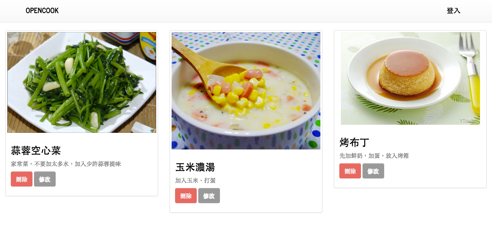
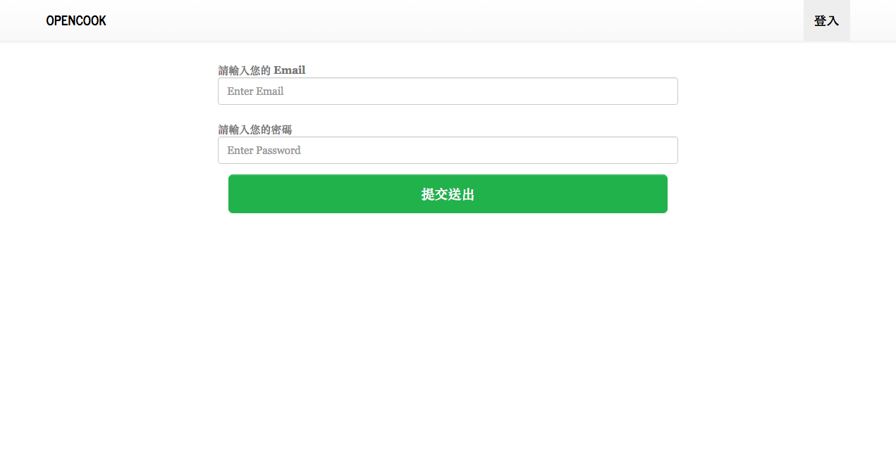
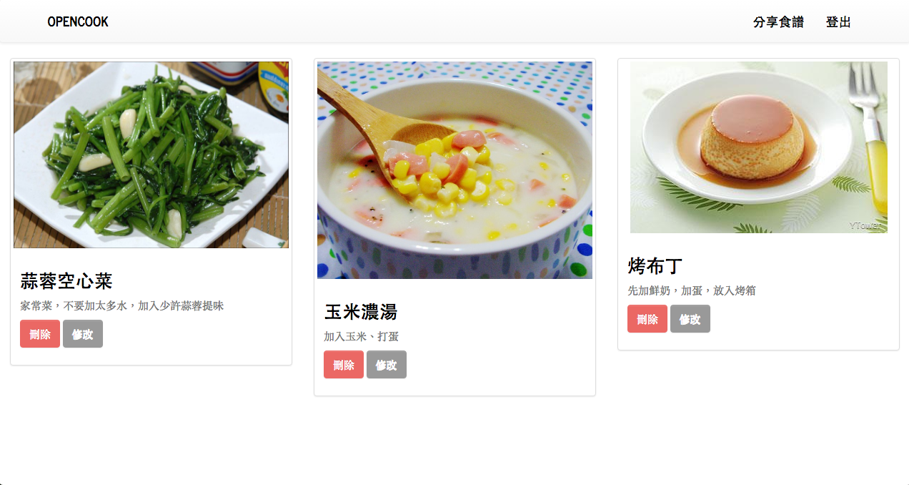
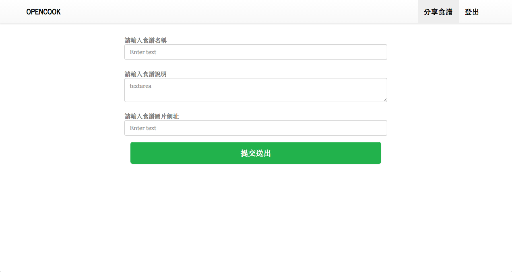
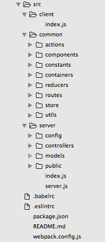

# 用 React + Redux + Node（Isomorphic JavaScript）開發食譜分享網站

## 前言
如果你是從一開始跟著我們踏出 React 旅程的讀者真的恭喜你，也謝謝你一路跟著我們的學習腳步，對一個初學者來說這一段路並不容易。本章是扣除附錄外我們最後一個正式章節的範例，也是規模最大的一個，在這個章節中我們要整合過去所學和添加一些知識開發一個可以登入會員並分享食譜的社群網站，Les's GO！

## 需求規劃
讓使用者可以登入會員並分享食譜的社群網站

## 功能規劃
1. React Router / Redux / Immutable / Server Render / Async API
2. 使用者登入/登出（JSON Web Token）
3. CRUD 表單資料處理
4. 資料庫串接(ORM/MongoDB)

## 使用技術
1. React
2. Redux(redux-actions/redux-promise/redux-immutable)
3. React Router
4. ImmutableJS
5. Node MongoDB ORM(Mongoose)
6. JSON Web Token
7. React Bootstrap
8. Axios(Promise)
9. Webpack
10. UUID

## 專案成果截圖









## 環境安裝與設定
1. 安裝 Node 和 NPM

2. 安裝所需套件

```
$ npm install --save react react-dom redux react-redux react-router immutable redux-immutable redux-actions redux-promise bcrypt body-parser cookie-parser debug express immutable jsonwebtoken mongoose morgan passport passport-local react-router-bootstrap axios serve-favicon validator uuid
```

```
$ npm install --save-dev babel-core babel-eslint babel-loader babel-preset-es2015 babel-preset-react babel-preset-stage-1 eslint eslint-config-airbnb eslint-loader eslint-plugin-import eslint-plugin-jsx-a11y eslint-plugin-react html-webpack-plugin webpack webpack-dev-server redux-logger
```

接下來我們先設定一下開發文檔。

1. 設定 Babel 的設定檔： `.babelrc`

	```javascript
	{
		"presets": [
	  	"es2015",
	  	"react",
	 	],
		"plugins": []
	}

	```

2. 設定 ESLint 的設定檔和規則： `.eslintrc`

	```javascript
	{
	  "extends": "airbnb",
	  "rules": {
	    "react/jsx-filename-extension": [1, { "extensions": [".js", ".jsx"] }],
	  },
	  "env" :{
	    "browser": true,
	  }
	}
	```

3. 設定 Webpack 設定檔： `webpack.config.js`：

	```javascript
	import webpack from 'webpack';

	module.exports = {
	  entry: [
	    './src/client/index.js',
	  ],
	  output: {
	    path: `${__dirname}/dist`,
	    filename: 'bundle.js',
	    publicPath: '/static/'
	  },
	  module: {
	    preLoaders: [
	      {
	        test: /\.jsx$|\.js$/,
	        loader: 'eslint-loader',
	        include: `${__dirname}/app`,
	        exclude: /bundle\.js$/,
	      },
	    ],
	    // 使用 Hot Module Replacement 外掛
	    plugins: [
	      new webpack.optimize.OccurrenceOrderPlugin(),
	      new webpack.HotModuleReplacementPlugin()
	    ],    
	    loaders: [{
	      test: /\.js$/,
	      exclude: /node_modules/,
	      loader: 'babel-loader',
	      query: {
	        presets: ['es2015', 'react'],
	      },
	    }],
	  },
	};
	```

4. 設定 `src/server/config/index.js`：

```javascript
export default ({
  "secret": "ilovecooking",
	"database": "mongodb://localhost/open_cook"
});
```	

太好了！這樣我們就完成了開發環境的設定可以開始動手實作我們的食譜分享社群應用程式了！	

同時我們也初步設計我們資料夾結構，主要我們將資料夾分為 `client`、`common`、`server`：



## 動手實作

首先我們先進行 `src/client/index.js` 的設計：

```javascript
import React from 'react';
import ReactDOM from 'react-dom';
import { Provider } from 'react-redux';
import { browserHistory, Router } from 'react-router';
import { fromJS } from 'immutable';
// 我們的 routing 放置在 common 資料夾中的 routes
import routes from '../common/routes';
import configureStore from '../common/store/configureStore';
import { checkAuth } from '../common/actions';

// 將 server side 傳過來的 initialState 給 rehydration（覆水）
const initialState = window.__PRELOADED_STATE__;

// 將 initialState 傳給 configureStore 函數創建出 store 並傳給 Provider
const store = configureStore(fromJS(initialState));
ReactDOM.render(
  <Provider store={store}>
    <Router history={browserHistory} routes={routes} />
  </Provider>,
  document.getElementById('app')
);
```

由於 Node 端要到新版對於 ES6 支援較好，所以先用 `babel-register` 在 `src/server/index.js` 去即時轉譯 `server.js`，但不建議在 `production` 環境使用。

```javascript
// use babel-register to precompile ES6 
require('babel-register');
require('./server');
```

```javascript
// 引入 Express、mongoose（MongoDB ORM）以及相關 server 上使用的套件
/* Server Packages */
import Express from 'express';
import bodyParser from 'body-parser';
import cookieParser from 'cookie-parser';
import morgan from 'morgan';
import mongoose from 'mongoose';
import config from './config';
// 引入後端 model 透過 model 和資料庫互動 
import User from './models/user';
import Recipe from './models/recipe';

// 引入 webpackDevMiddleware 當做前端 server middleware
/* Client Packages */
import webpack from 'webpack';
import React from 'react';
import webpackDevMiddleware from 'webpack-dev-middleware';
import webpackHotMiddleware from 'webpack-hot-middleware';
import { RouterContext, match } from 'react-router';
import { renderToString } from 'react-dom/server';
import { Provider } from 'react-redux';
import Immutable, { fromJS } from 'immutable';
/* Common Packages */
import webpackConfig from '../../webpack.config';
import routes from '../common/routes';
import configureStore from '../common/store/configureStore';
import fetchComponentData from '../common/utils/fetchComponentData';
import apiRoutes from './controllers/api.js';
/* config */
// 初始化 Express server
const app = new Express();
const port = process.env.PORT || 3000;
// 連接到資料庫，相關設定檔案放在 config.database
mongoose.connect(config.database); // connect to database
app.set('env', 'production');
// 設定靜態檔案位置
app.use('/static', Express.static(__dirname + '/public'));
app.use(cookieParser());
// use body parser so we can get info from POST and/or URL parameters
app.use(bodyParser.urlencoded({ extended: false })); // only can deal with key/value
app.use(bodyParser.json());
// use morgan to log requests to the console
app.use(morgan('dev'));

// 負責每次接受到 request 的處理函數，判斷該如何處理和取得 initialState 整理後結合伺服器渲染頁面傳往前端
const handleRender = (req, res) => {
  // Query our mock API asynchronously
  match({ routes, location: req.url }, (error, redirectLocation, renderProps) => {
    if (error) {
      res.status(500).send(error.message);
    } else if (redirectLocation) {
      res.redirect(302, redirectLocation.pathname + redirectLocation.search);
    } else if (renderProps == null) {
      res.status(404).send('Not found');
    }
    fetchComponentData(req.cookies.token).then((response) => {
      let isAuthorized = false;
      if (response[1].data.success === true) {
         isAuthorized = true;
      } else {
        isAuthorized = false;        
      }
      const initialState = fromJS({
        recipe: {
          recipes: response[0].data,
          recipe: {
            id: '',
            name: '', 
            description: '', 
            imagePath: '',            
          }  
        },
        user: {
          isAuthorized: isAuthorized,
          isEdit: false,
        }
      });
      // server side 渲染頁面
      // Create a new Redux store instance
      const store = configureStore(initialState);
      const initView = renderToString(
        <Provider store={store}>
          <RouterContext {...renderProps} />
        </Provider>
      );
      let state = store.getState();
      let page = renderFullPage(initView, state);
      return res.status(200).send(page);
    })
    .catch(err => res.end(err.message));
  })
}

// 基礎頁面 HTML 設計
const renderFullPage = (html, preloadedState) => (`
    <!doctype html>
    <html>
      <head>
        <title>OpenCook 分享料理的美好時光</title>
        <!-- Latest compiled and minified CSS -->
        <link rel="stylesheet" href="//maxcdn.bootstrapcdn.com/bootstrap/latest/css/bootstrap.min.css">
        <!-- Optional theme -->
        <link rel="stylesheet" href="//maxcdn.bootstrapcdn.com/bootstrap/latest/css/bootstrap-theme.min.css">
        <link rel="stylesheet" href="//maxcdn.bootstrapcdn.com/bootswatch/3.3.7/journal/bootstrap.min.css">
      <body>
        <div id="app">${html}</div>
        <script>
          window.__PRELOADED_STATE__ = ${JSON.stringify(preloadedState).replace(/</g, '\\x3c')}
        </script>
        <script src="/static/bundle.js"></script>
      </body>
    </html>`
);

// 設定 hot reload middleware
const compiler = webpack(webpackConfig);
app.use(webpackDevMiddleware(compiler, { noInfo: true, publicPath: webpackConfig.output.publicPath }));
app.use(webpackHotMiddleware(compiler));

// 設計 API prefix，並使用 controller 中的 apiRoutes 進行處理
app.use('/api', apiRoutes);  
// 使用伺服器端 handleRender 
app.use(handleRender);
app.listen(port, (error) => {
  if (error) {
    console.error(error)
  } else {
    console.info(`==> 🌎  Listening on port ${port}. Open up http://localhost:${port}/ in your browser.`)
  }
});
```

由於 Node 端要到新版對於 ES6 支援較好，所以先用 `babel-register` 在 `src/server/index.js` 去即時轉譯 `server.js`，但目前不建議在 `production` 環境使用。

```javascript
// use babel-register to precompile ES6 syntax
require('babel-register');
require('./server');
```

現在我們來設計一下我們資料庫的 Schema，在這邊我們使用 MongoDB 的 ORM Mongoose，可以方便我們使用物件方式進行資料庫的操作：

```javascript
// 引入 mongoose 和 Schema
import mongoose, { Schema } from 'mongoose';

// 使用 mongoose.model 建立新的資料表，並將 Schema 傳入
// 這邊我們設計了食譜分享的一些基本要素，包括名稱、描述、照片位置等
export default mongoose.model('Recipe', new Schema({ 
    id: String,
    name: String, 
    description: String, 
    imagePath: String,
    steps: Array,
    updatedAt: Date,
}));
```

```javascript
// 引入 mongoose 和 Schema
import mongoose, { Schema } from 'mongoose';

// 使用 mongoose.model 建立新的資料表，並將 Schema 傳入
// 這邊我們設計了使用者的一些基本要素，包括名稱、描述、照片位置等
export default mongoose.model('User', new Schema({ 
    id: Number,
    username: String, 
    email: String,
    password: String, 
    admin: Boolean 
}));
```

為了方便維護，我們把 API 的部份統一在 `src/server/controllers/api.js` 進行管理，這部份會涉及比較多 Node 和 mongoose 的操作，若讀者尚不熟悉可以參考 [mongoose 官網](http://mongoosejs.com/)

```javascript
import Express from 'express';
// 引入 jsonwebtoken 套件 
import jwt from 'jsonwebtoken';
// 引入 User、Recipe Model 方便進行資料庫操作
import User from '../models/user';
import Recipe from '../models/recipe';
import config from '../config';

// API Route
const app = new Express();
const apiRoutes = Express.Router();
// 設定 JSON Web Token 的 secret variable
app.set('superSecret', config.secret); // secret variable
// 使用者登入 API ，依據使用 email 和 密碼去驗證，若成功則回傳一個認證 token（時效24小時）我們把它存在 cookie 中，方便前後端存取。這邊我們先不考慮太多資訊安全的議題
apiRoutes.post('/login', function(req, res) {
  // find the user
  User.findOne({
    email: req.body.email
  }, (err, user) => {
    if (err) throw err;
    if (!user) {
      res.json({ success: false, message: 'Authentication failed. User not found.' });
    } else if (user) {
      // check if password matches
      if (user.password != req.body.password) {
        res.json({ success: false, message: 'Authentication failed. Wrong password.' });
      } else {
        // if user is found and password is right
        // create a token
        const token = jwt.sign({ email: user.email }, app.get('superSecret'), {
          expiresIn: 60 * 60 * 24 // expires in 24 hours
        });
        // return the information including token as JSON
        // 若登入成功回傳一個 json 訊息
        res.json({
          success: true,
          message: 'Enjoy your token!',
          token: token,
          userId: user._id
        });
      }   
    }
  });
});
// 初始化 api，一開始資料庫尚未建立任何使用者，我們需要在瀏覽器輸入 `http://localhost:3000/api/setup`，進行資料庫初始化。這個動作將新增一個使用者、一份食譜，若是成功新增將回傳一個 success 訊息
apiRoutes.get('/setup', (req, res) => {
  // create a sample user
  const sampleUser = new User({ 
    username: 'mark', 
    email: 'mark@demo.com', 
    password: '123456',
    admin: true 
  });
  const sampleRecipe = new Recipe({
    id: '110ec58a-a0f2-4ac4-8393-c866d813b8d1',
    name: '番茄炒蛋', 
    description: '番茄炒蛋，一道非常經典的家常菜料理。雖然看似普通，但每個家庭都有屬於自己家裡的不同味道', 
    imagePath: 'https://c1.staticflickr.com/6/5011/5510599760_6668df5a8a_z.jpg',
    steps: ['放入番茄', '打個蛋', '放入少許鹽巴', '用心快炒'],
    updatedAt: new Date()
  });
  // save the sample user
  sampleUser.save((err) => {
    if (err) throw err;
    sampleRecipe.save((err) => {
      if (err) throw err;
      console.log('User saved successfully');
      res.json({ success: true });      
    })
  });
});
// 回傳所有 recipes
apiRoutes.get('/recipes', (req, res) => {
  Recipe.find({}, (err, recipes) => {
    res.status(200).json(recipes);
  })
});

// route middleware to verify a token
// 接下來的 api 將進行控管，也就是說必須在網址請求中夾帶認證 token 才能完成請求
apiRoutes.use((req, res, next) => {
  // check header or url parameters or post parameters for token
  // 確認標頭、網址或 post 參數是否含有 token，本範例因為簡便使用網址 query 參數 
  var token = req.body.token || req.query.token || req.headers['x-access-token'];
  // decode token
  if (token) {
    // verifies secret and checks exp
    jwt.verify(token, app.get('superSecret'), (err, decoded) => {      
      if (err) {
        return res.json({ success: false, message: 'Failed to authenticate token.' });    
      } else {
        // if everything is good, save to request for use in other routes
        req.decoded = decoded;    
        next();
      }
    });
  } else {
    // if there is no token
    // return an error
    return res.status(403).send({ 
        success: false, 
        message: 'No token provided.' 
    });
  }
});
// 確認認證是否成功
apiRoutes.get('/authenticate', (req, res) => {
  res.json({
    success: true,
    message: 'Enjoy your token!',
  });
});
// create recipe 新增食譜
apiRoutes.post('/recipes', (req, res) => {
  const newRecipe = new Recipe({
    name: req.body.name, 
    description: req.body.description, 
    imagePath: req.body.imagePath,
    steps: ['放入番茄', '打個蛋', '放入少許鹽巴', '用心快炒'],
    updatedAt: new Date()
  });
  newRecipe.save((err) => {
    if (err) throw err;
    console.log('User saved successfully');
    res.json({ success: true });      
  });
}); 
// update recipe 根據 _id（mongodb 的 id）更新食譜
apiRoutes.put('/recipes/:id', (req, res) => {
  Recipe.update({ _id: req.params.id }, {
    name: req.body.name, 
    description: req.body.description, 
    imagePath: req.body.imagePath,
    steps: ['放入番茄', '打個蛋', '放入少許鹽巴', '用心快炒'],
    updatedAt: new Date()
  } ,(err) => {
    if (err) throw err;
    console.log('User updated successfully');
    res.json({ success: true });      
  });
});
// remove recipe 根據 _id 刪除食譜，若成功回傳成功訊息
apiRoutes.delete('/recipes/:id', (req, res) => {
  Recipe.remove({ _id: req.params.id }, (err, recipe) => {
    if (err) throw err;
    console.log('remove saved successfully');
    res.json({ success: true }); 
  });
}); 
export default apiRoutes;
```

設定整個 App 的 routing，我們主要頁面有 `HomePageContainer`、`LoginPageContainer`、`SharePageContainer`，值得注意的是我們這邊使用 [Higher Order Components](http://www.darul.io/post/2016-01-05_react-higher-order-components) （Higher Order Components 為一個函數， 接收一個 Component 後在 Class Component 的 render 中 return 回傳入的 components）方式去確認使用者是否有登入，若有沒登入則不能進入分享食譜頁面，反之若已登入也不會再進到登入頁面：

```javascript
import React from 'react';
import { Route, IndexRoute } from 'react-router';
import Main from '../components/Main';
import CheckAuth from '../components/CheckAuth';
import HomePageContainer from '../containers/HomePageContainer';
import LoginPageContainer from '../containers/LoginPageContainer';
import SharePageContainer from '../containers/SharePageContainer';

export default (
  <Route path='/' component={Main}>
    <IndexRoute component={HomePageContainer} />
    <Route path="/login" component={CheckAuth(LoginPageContainer, 'guest')}/>
    <Route path="/share" component={CheckAuth(SharePageContainer, 'auth')}/>
  </Route>
);
```

設定行為常數（`src/constants/actionTypes.js`）：

```javascript
export const AUTH_START    = "AUTH_START";
export const AUTH_COMPLETE = "AUTH_COMPLETE";
export const AUTH_ERROR    = "AUTH_ERROR";
export const START_LOGOUT    = "START_LOGOUT";
export const CHECK_AUTH    = "CHECK_AUTH";
export const SET_USER    = "SET_USER";
export const SHOW_SPINNER    = "SHOW_SPINNER";
export const HIDE_SPINNER    = "HIDE_SPINNER";
export const SET_UI    = "SET_UI";
export const GET_RECIPES = 'GET_RECIPES';
export const SET_RECIPE = 'SET_RECIPE';
export const ADD_RECIPE = 'ADD_RECIPE';
export const UPDATE_RECIPE = 'UPDATE_RECIPE';
export const DELETE_RECIPE = 'DELETE_RECIPE';
```

設定 `src/actions/recipeActions.js`，我們這邊使用 redux-promise，可以很容易使用非同步的行為 WebAPI：  

```javascript
import { createAction } from 'redux-actions';
import WebAPI from '../utils/WebAPI';

import {
  GET_RECIPES,
  ADD_RECIPE,
  UPDATE_RECIPE,
  DELETE_RECIPE,
  SET_RECIPE,
} from '../constants/actionTypes';

export const getRecipes = createAction('GET_RECIPES', WebAPI.getRecipes);
export const addRecipe = createAction('ADD_RECIPE', WebAPI.addRecipe);
export const updateRecipe = createAction('UPDATE_RECIPE', WebAPI.updateRecipe);
export const deleteRecipe = createAction('DELETE_RECIPE', WebAPI.deleteRecipe);
export const setRecipe = createAction('SET_RECIPE');
```

設定 `src/actions/uiActions.js`：

```javascript
import { createAction } from 'redux-actions';
import WebAPI from '../utils/WebAPI';

import {
  SHOW_SPINNER,
  HIDE_SPINNER,
  SET_UI,
} from '../constants/actionTypes';

export const showSpinner = createAction('SHOW_SPINNER');
export const hideSpinner = createAction('HIDE_SPINNER');
export const setUi = createAction('SET_UI');
```

設定 `src/actions/userActions.js`，處理使用者登入登出等行為：

```javascript
import { createAction } from 'redux-actions';
import WebAPI from '../utils/WebAPI';

import {
  AUTH_START,
  AUTH_COMPLETE,
  AUTH_ERROR,
  START_LOGOUT,
  CHECK_AUTH,
  SET_USER
} from '../constants/actionTypes';

export const authStart = createAction('AUTH_START', WebAPI.login);
export const authComplete = createAction('AUTH_COMPLETE');
export const authError = createAction('AUTH_ERROR');
export const startLogout = createAction('START_LOGOUT', WebAPI.logout);
export const checkAuth = createAction('CHECK_AUTH');
export const setUser = createAction('SET_USER');
```

於 `scr/actions/index.js` 輸出 actions：

```javascript
export * from './userActions';
export * from './recipeActions';
export * from './uiActions';
```

於 `scr/common/utils/fetchComponentData.js` 設定 server side 初始 fetchComponentData：

```javascript
// 這邊使用 axios 方便進行 promises base request
import axios from 'axios';
// 記得附加上我們存在 cookies 的 token  
export default function fetchComponentData(token = 'token') {
  const promises = [axios.get('http://localhost:3000/api/recipes'), axios.get('http://localhost:3000/api/authenticate?token=' + token)];
  return Promise.all(promises);
}
```

於 `scr/common/utils/WebAPI.js` 所有前端 API 的處理：

```javascript
import axios from 'axios';
import { browserHistory } from 'react-router';
// 引入 uuid 當做食譜 id
import uuid from 'uuid';

import { 
  authComplete,
  authError,
  hideSpinner,
  completeLogout,
} from '../actions';

// getCookie 函數傳入 key 回傳 value
function getCookie(keyName) {
  var name = keyName + '=';
  const cookies = document.cookie.split(';');
  for(let i = 0; i < cookies.length; i++) {
      let cookie = cookies[i];
      while (cookie.charAt(0)==' ') {
          cookie = cookie.substring(1);
      }
      if (cookie.indexOf(name) == 0) {
        return cookie.substring(name.length, cookie.length);
      }
  }
  return "";
}

export default {
  // 呼叫後端登入 api
  login: (dispatch, email, password) => {
    axios.post('/api/login', {
      email: email,
      password: password
    })
    .then((response) => {
      if(response.data.success === false) {
        dispatch(authError()); 
        dispatch(hideSpinner());  
        alert('發生錯誤，請再試一次！');
        window.location.reload();        
      } else {
        if (!document.cookie.token) {
          let d = new Date();
          d.setTime(d.getTime() + (24 * 60 * 60 * 1000));
          const expires = 'expires=' + d.toUTCString();
          document.cookie = 'token=' + response.data.token + '; ' + expires;
          dispatch(authComplete());
          dispatch(hideSpinner());  
          browserHistory.push('/'); 
        }
      }
    })
    .catch(function (error) {
      dispatch(authError());
    });
  },
  // 呼叫後端登出 api  
  logout: (dispatch) => {
    document.cookie = 'token=; ' + 'expires=Thu, 01 Jan 1970 00:00:01 GMT;';
    dispatch(hideSpinner());  
    browserHistory.push('/'); 
  },
  // 確認使用者是否登入    
  checkAuth: (dispatch, token) => {
    axios.post('/api/authenticate', {
      token: token,
    })
    .then((response) => {
      if(response.data.success === false) {
        dispatch(authError()); 
      } else {
        dispatch(authComplete());
      }
    })
    .catch(function (error) {
      dispatch(authError());
    });
  },
  // 取得目前所有食譜    
  getRecipes: () => {
    axios.get('/api/recipes')
    .then((response) => {
    })
    .catch((error) => {
    });
  },
  // 呼叫新增食譜 api，記得附加上我們存在 cookies 的 token  
  addRecipe: (dispatch, name, description, imagePath) => {
    const id = uuid.v4();
    axios.post('/api/recipes?token=' + getCookie('token'), {
      id: id,
      name: name,
      description: description,
      imagePath: imagePath,
    })
    .then((response) => {
      if(response.data.success === false) {
        dispatch(hideSpinner());  
        alert('發生錯誤，請再試一次！');
        browserHistory.push('/share');         
      } else {
        dispatch(hideSpinner());  
        window.location.reload();        
        browserHistory.push('/'); 
      }
    })
    .catch(function (error) {
    });
  },
  // 呼叫更新食譜 api，記得附加上我們存在 cookies 的 token  
  updateRecipe: (dispatch, recipeId, name, description, imagePath) => {
    axios.put('/api/recipes/' + recipeId + '?token=' + getCookie('token'), {
      id: recipeId,
      name: name,
      description: description,
      imagePath: imagePath,
    })
    .then((response) => {
      if(response.data.success === false) {
        dispatch(hideSpinner());  
        dispatch(setRecipe({ key: 'recipeId', value: '' }));
        dispatch(setUi({ key: 'isEdit', value: false }));
        alert('發生錯誤，請再試一次！');
        browserHistory.push('/share');         
      } else {
        dispatch(hideSpinner());  
        window.location.reload();        
        browserHistory.push('/'); 
      }
    })
    .catch(function (error) {
    });
  },
  // 呼叫刪除食譜 api，記得附加上我們存在 cookies 的 token  
  deleteRecipe: (dispatch, recipeId) => {
    axios.delete('/api/recipes/' + recipeId + '?token=' + getCookie('token'))
    .then((response) => {
      if(response.data.success === false) {
        dispatch(hideSpinner());  
        alert('發生錯誤，請再試一次！');
        browserHistory.push('/');         
      } else {
        dispatch(hideSpinner());  
        window.location.reload();        
        browserHistory.push('/'); 
      }
    })
    .catch(function (error) {
    });    
  } 
};
```

接下來設定我們的 `reducers`，以下是 `src/common/reducers/data/recipeReducers.js`，`GET_RECIPES` 負責將後端 API 取得的所有食譜存放在 recipes 中：

```javascript
import { handleActions } from 'redux-actions';
import { RecipeState } from '../../constants/models';

import {
  GET_RECIPES,
  SET_RECIPE,
} from '../../constants/actionTypes';

const recipeReducers = handleActions({
  GET_RECIPES: (state, { payload }) => (
    state.set(
      'recipes',
      payload.recipes
    )
  ),
  SET_RECIPE: (state, { payload }) => (
    state.setIn(payload.keyPath, payload.value)
  ),  
}, RecipeState);

export default recipeReducers;
```

以下是 `src/common/reducers/data/userReducers.js`，負責確認登入相關處理事項。注意的是由於登入是非同步執行，所以會有幾個階段的行為要做處理：

```javascript
import { handleActions } from 'redux-actions';
import { UserState } from '../../constants/models';

import {
  AUTH_START,
  AUTH_COMPLETE,
  AUTH_ERROR,
  LOGOUT_START,
  SET_USER,
} from '../../constants/actionTypes';

const userReducers = handleActions({
  AUTH_START: (state) => (
    state.merge({
      isAuthorized: false,      
    })
  ),  
  AUTH_COMPLETE: (state) => (
    state.merge({
      email: '',
      password: '',
      isAuthorized: true,
    })
  ),  
  AUTH_ERROR: (state) => (
    state.merge({
      username: '',
      email: '',
      password: '',
      isAuthorized: false,
    })
  ),  
  START_LOGOUT: (state) => (
    state.merge({
      isAuthorized: false,      
    })
  ), 
  CHECK_AUTH: (state) => (
    state.set('isAuthorized', true)
  ),
  SET_USER: (state, { payload }) => (
    state.set(payload.key, payload.value)
  ),
}, UserState);

export default userReducers;

```

以下是 `src/common/reducers/ui/uiReducers.js`，負責確認 UI State 相關處理：


```javascript
import { handleActions } from 'redux-actions';
import { UiState } from '../../constants/models';

import {
  SHOW_SPINNER,
  HIDE_SPINNER,
  SET_UI,
} from '../../constants/actionTypes';

const uiReducers = handleActions({
  SHOW_SPINNER: (state) => (
    state.set(
      'spinnerVisible',
      true
    )
  ),
  HIDE_SPINNER: (state) => (
    state.set(
      'spinnerVisible',
      false
    )
  ),
  SET_UI: (state, { payload }) => (
    state.set(payload.key, payload.value)
  ),    
}, UiState);

export default uiReducers;
```

最後把所有 recipes 在 `src/common/reducers/index.js` 使用 `combineReducers` 整合在一起，注意的是我們整個 App 的資料流要維持 immutable： 

```javascript
import { combineReducers } from 'redux-immutable';
import ui from './ui/uiReducers';
import recipe from './data/recipeReducers';
import user from './data/userReducers';
// import routes from './routes';

const rootReducer = combineReducers({
  ui,
  recipe,
  user,
});

export default rootReducer;
```

以下是 `src/common/store/configureStore.js` 處理 store 的建立，這次我們使用了 `promiseMiddleware` 的 middleware：

```javascript
import { createStore, applyMiddleware } from 'redux';
import promiseMiddleware from 'redux-promise';
import createLogger from 'redux-logger';
import Immutable from 'immutable';
import rootReducer from '../reducers';

const initialState = Immutable.Map();

export default function configureStore(preloadedState = initialState) {
  const store = createStore(
    rootReducer,
    preloadedState,
    applyMiddleware(createLogger({ stateTransformer: state => state.toJS() }, promiseMiddleware))
  );

  return store;
}
```

經過一連串努力，我們來到了 View 的佈建。在這個 App 中我們主要會由一個 AppBar 負責所有頁面的導覽，也就是每個頁面都會有 AppBar 常駐在上面，然而上面的內容則會依 UI State 中的 isAuthorized 而有所不同。最後要留意的是我們使用了 React Bootstrapt 來建立 React Component。

```javascript
import React from 'react';
import { LinkContainer } from 'react-router-bootstrap';
import { Link } from 'react-router';
import { Navbar, Nav, NavItem, NavDropdown, MenuItem } from 'react-bootstrap';

const AppBar = ({
  isAuthorized,
  onToShare,
  onLogout,
}) => (
  <Navbar>
    <Navbar.Header>
      <Navbar.Brand>
        <Link to="/">OpenCook</Link>
      </Navbar.Brand>
      <Navbar.Toggle />
    </Navbar.Header>
    <Navbar.Collapse>
      {
        isAuthorized === false ?
        (
          <Nav pullRight>
            <LinkContainer to={{ pathname: '/login' }}><NavItem eventKey={2} href="#">登入</NavItem></LinkContainer>
          </Nav>
        ) :
        (
          <Nav pullRight>
            <NavItem eventKey={1} onClick={onToShare}>分享食譜</NavItem>
            <NavItem eventKey={2} onClick={onLogout} href="#">登出</NavItem>
          </Nav>
        )        
      }
    </Navbar.Collapse>
  </Navbar>
);

export default AppBar;
```

以下是 `src/common/containers/AppBarContainer/AppBarContainer.js`：

```javascript
import React from 'react';
import { connect } from 'react-redux';
import AppBar from '../../components/AppBar';
import { browserHistory } from 'react-router';

import {
  startLogout,
  setRecipe,
  setUi,
} from '../../actions';

export default connect(
  (state) => ({
    isAuthorized: state.getIn(['user', 'isAuthorized']),
  }),
  (dispatch) => ({
    onToShare: () => {
      dispatch(setRecipe({ key: 'recipeId', value: '' }));
      dispatch(setUi({ key: 'isEdit', value: false }));
      window.location.reload();        
      browserHistory.push('/share'); 
    },
    onLogout: () => (
      dispatch(startLogout(dispatch))
    ),
  })
)(AppBar);
```

以下是 `src/components/Main/Main.js`，透過 route 機制讓 AppBarContainer 可以成為整個 App 母模版：

```javascript
import React from 'react';
import AppBarContainer from '../../containers/AppBarContainer';

const Main = (props) => (
  <div>
    <AppBarContainer />
    <div>
      {props.children}
    </div>
  </div>
);

export default Main;
```

 在 `checkAuth` 這個 Component 中，我們使用到了 Higher Order Components 的觀念。Higher Order Components 為一個函數， 接收一個 Component 後在 Class Component 的 render 中 return 回傳入的 components 方式去確認使用者是否有登入，若有沒登入則不能進入分享食譜頁面，反之若已登入也不會再進到登入頁面：

```javascript
import React from 'react';
import { connect } from 'react-redux';
import { withRouter } from 'react-router';

// High Order Component
export default function requireAuthentication(Component, type) {
  class AuthenticatedComponent extends React.Component {
    componentWillMount() {
      this.checkAuth();
    }
    componentWillReceiveProps(nextProps) {
      this.checkAuth();
    }
    checkAuth() {
      if(type === 'auth') {
        if (!this.props.isAuthorized) {
          this.props.router.push('/');
        }        
      } else {
        if (this.props.isAuthorized) {
          this.props.router.push('/');
        }                
      }
    }
    render() {
      return ( 
        <div> 
        {
          (type === 'auth') ?
          this.props.isAuthorized === true ? <Component {...this.props } /> : null
          : this.props.isAuthorized === false ? <Component {...this.props } /> : null
        } 
        </div>
      )
    }
  };
  const mapStateToProps = (state) => ({
    isAuthorized: state.getIn(['user', 'isAuthorized']),
  });
  return connect(mapStateToProps)(withRouter(AuthenticatedComponent));
}
```

我們將每個食譜呈現設計成 RecipeBox，以下是在 `src/common/components/HomePage/HomePage.js` 使用 map 方法去迭代我們的食譜：

```javascript
import React from 'react';
import RecipeBoxContainer from '../../containers/RecipeBoxContainer';

const HomePage = ({
  recipes
}) => (
  <div>        
  {
    recipes.map((recipe, index) => (
      <RecipeBoxContainer recipe={recipe} key={index}  />
    )).toJS()
  }
  </div>
);

export default HomePage;
```

以下是 `src/common/containers/HomePageContainer/HomePageContainer.js`：


```javascript
import React from 'react';
import { connect } from 'react-redux';
import HomePage from '../../components/HomePage';

export default connect(
  (state) => ({
    recipes: state.getIn(['recipe', 'recipes']),    
  }),
  (dispatch) => ({
  })
)(HomePage);
```

在 `src/common/components/LoginBox/LoginBox.js` 設計我們 LoginBox：

```javascript
import React from 'react';
import { Form, FormGroup, Button, FormControl, ControlLabel } from 'react-bootstrap';

const LoginBox = ({
  email,
  password,
  onChangeEmailInput,
  onChangePasswordInput,
  onLoginSubmit
}) => (
  <div>
    <Form horizontal>
      <FormGroup
        controlId="formBasicText"
      >
        <ControlLabel>請輸入您的 Email</ControlLabel>
        <FormControl
          type="text"
          onChange={onChangeEmailInput}
          placeholder="Enter Email"
        />
        <FormControl.Feedback />
      </FormGroup>
      <FormGroup
        controlId="formBasicText"
      >
        <ControlLabel>請輸入您的密碼</ControlLabel>
        <FormControl
          type="password"
          onChange={onChangePasswordInput}
          placeholder="Enter Password"
        />
        <FormControl.Feedback />
      </FormGroup>
      <Button 
        onClick={onLoginSubmit} 
        bsStyle="success" 
        bsSize="large" 
        block
      >
        提交送出
      </Button>
    </Form>
  </div>
);

export default LoginBox;
```

以下是 `src/common/containers/LoginBoxContainer/LoginBoxContainer.js`：


```javascript
import React from 'react';
import { connect } from 'react-redux';
import LoginBox from '../../components/LoginBox';

import { 
  authStart,
  showSpinner,
  setUser,
} from '../../actions';

export default connect(
  (state) => ({
    email: state.getIn(['user', 'email']),
    password: state.getIn(['user', 'password']),
  }),
  (dispatch) => ({
    onChangeEmailInput: (event) => (
      dispatch(setUser({ key: 'email', value: event.target.value }))
    ),
    onChangePasswordInput: (event) => (
      dispatch(setUser({ key: 'password', value: event.target.value }))
    ),
    onLoginSubmit: (email, password) => () => {
      dispatch(authStart(dispatch, email, password));
      dispatch(showSpinner());
    },
  }),
  (stateProps, dispatchProps, ownProps) => {
    const { email, password } = stateProps;
    const { onLoginSubmit } = dispatchProps;
    return Object.assign({}, stateProps, dispatchProps, ownProps, {
      onLoginSubmit: onLoginSubmit(email, password),
    });
  }
)(LoginBox);

```

在 `src/common/components/LoginPage/LoginPage.js`，當 spinnerVisible 為 true 會顯示 spinner：


```javascript
import React from 'react';
import { Grid, Row, Col, Image } from 'react-bootstrap';
import LoginBoxContainer from '../../containers/LoginBoxContainer';

const LoginPage = ({
  spinnerVisible,
}) => (
  <div>
    <Row className="show-grid">
      <Col xs={6} xsOffset={3}>
        <LoginBoxContainer />
        { spinnerVisible === true ?
          <Image src="/static/images/loading.gif" /> :
          null
        }
      </Col>
    </Row>
  </div>
);

export default LoginPage;
```

以下是 `src/common/containers/LoginPageContainer/LoginPageContainer.js`：


```
import React from 'react';
import { connect } from 'react-redux';
import LoginPage from '../../components/LoginPage';

export default connect(
  (state) => ({
    spinnerVisible: state.getIn(['ui', 'spinnerVisible']),
  }),
  (dispatch) => ({
  })
)(LoginPage);


```

真正設計我們內部的食譜， `src/common/components/RecipeBox`，使用者登入的話可以修改和刪除食譜：

```javascript
import React from 'react';
import { Grid, Row, Col, Image, Thumbnail, Button } from 'react-bootstrap';

const RecipeBox = (props) => {
  return(
      <Col xs={6} md={4}>
        <Thumbnail src={props.recipe.get('imagePath')} alt="242x200">
          <h3>{props.recipe.get('name')}</h3>
          <p>{props.recipe.get('description')}</p>
          {
            props.isAuthorized === true ? (
            <p>
              <Button bsStyle="primary" onClick={props.onDeleteRecipe(props.recipe.get('_id'))}>刪除</Button>&nbsp;
              <Button bsStyle="default" onClick={props.onUpadateRecipe(props.recipe.get('_id'))}>修改</Button>
            </p>)
            : null            
          }
        </Thumbnail>
      </Col>
    );
}

export default RecipeBox;
```

以下是 `src/common/containers/RecipeBoxContainer/RecipeBoxContainer.js`：


```javascript
import React from 'react';
import { connect } from 'react-redux';
import RecipeBox from '../../components/RecipeBox';
import { browserHistory } from 'react-router';

import {
  deleteRecipe,
  setRecipe,
  setUi
} from '../../actions';

export default connect(
  (state) => ({
    isAuthorized: state.getIn(['user', 'isAuthorized']),
    recipes: state.getIn(['recipe', 'recipes']),
  }),
  (dispatch) => ({
    onDeleteRecipe: (recipeId) => () => (
      dispatch(deleteRecipe(dispatch, recipeId))
    ),
    onUpadateRecipe: (recipes) => (recipeId) => () => {
      const recipeIndex = recipes.findIndex((_recipe) => (_recipe.get('_id') === recipeId));
      const recipe = recipeIndex !== -1 ? recipes.get(recipeIndex) : undefined;
      dispatch(setRecipe({ keyPath: ['recipe'], value: recipe }));
      dispatch(setRecipe({ keyPath: ['recipe', 'id'], value: recipeId }));
      dispatch(setUi({ key: 'isEdit', value: true }));
      browserHistory.push('/share?recipeId=' + recipeId); 
    },
  }),
  (stateProps, dispatchProps, ownProps) => {
    const { recipes } = stateProps; 
    const { onUpadateRecipe } = dispatchProps; 
    return Object.assign({}, stateProps, dispatchProps, ownProps, {
      onUpadateRecipe: onUpadateRecipe(recipes),
    });
  }
)(RecipeBox);


```


設計我們分享食譜頁面，這邊我們把編輯食譜和新增分享一起共用了同一個 components，差別在於我們會判斷 UI State 中的 `isEdit`， 決定相應處理方式。在中 `src/common/components/ShareBox/ShareBox.js`，可以讓使用者登入的後修改和刪除食譜：


```javascript
import React from 'react';
import { Form, FormGroup, Button, FormControl, ControlLabel } from 'react-bootstrap';

const ShareBox = (props) => {
  return (<div>
    <Form horizontal>
      <FormGroup
        controlId="formBasicText"
      >
        <ControlLabel>請輸入食譜名稱</ControlLabel>
        <FormControl
          type="text"
          placeholder="Enter text"
          defaultValue={props.name}
          onChange={props.onChangeNameInput}
        />
        <FormControl.Feedback />
      </FormGroup>
      <FormGroup
        controlId="formBasicText"
      >
        <ControlLabel>請輸入食譜說明</ControlLabel>
        <FormControl 
          componentClass="textarea" 
          placeholder="textarea" 
          defaultValue={props.description}          
          onChange={props.onChangeDescriptionInput}
        />
        <FormControl.Feedback />
      </FormGroup>
      <FormGroup
        controlId="formBasicText"
      >
        <ControlLabel>請輸入食譜圖片網址</ControlLabel>
        <FormControl
          type="text"
          placeholder="Enter text"
          defaultValue={props.imagePath}
          onChange={props.onChangeImageUrl}
        />
        <FormControl.Feedback />
      </FormGroup>
      <Button 
        onClick={props.onRecipeSubmit} 
        bsStyle="success" 
        bsSize="large" 
        block
      >
        提交送出
      </Button>
    </Form>
  </div>);
};

export default ShareBox;
```

以下是 `src/common/containers/ShareBoxContainer/ShareBoxContainer.js`：


```javascript
import React from 'react';
import { connect } from 'react-redux';
import ShareBox from '../../components/ShareBox';

import { 
  addRecipe,
  updateRecipe,
  showSpinner,
  setRecipe,
} from '../../actions';

export default connect(
  (state) => ({
    recipes: state.getIn(['recipe', 'recipes']),
    recipeId: state.getIn(['recipe', 'recipe', 'id']),
    name: state.getIn(['recipe', 'recipe', 'name']),
    description: state.getIn(['recipe', 'recipe', 'description']),
    imagePath: state.getIn(['recipe', 'recipe', 'imagePath']),
    isEdit: state.getIn(['ui', 'isEdit']),
  }),
  (dispatch) => ({
    onChangeNameInput: (event) => (
      dispatch(setRecipe({ keyPath: ['recipe', 'name'], value: event.target.value }))
    ),
    onChangeDescriptionInput: (event) => (
      dispatch(setRecipe({ keyPath: ['recipe', 'description'], value: event.target.value }))
    ),
    onChangeImageUrl: (event) => (
      dispatch(setRecipe({ keyPath: ['recipe', 'imagePath'], value: event.target.value }))
    ),    
    onRecipeSubmit: (recipes, recipeId, name, description, imagePath, isEdit) => () => {
      if (isEdit === true) {
        dispatch(updateRecipe(dispatch, recipeId, name, description, imagePath));
        dispatch(showSpinner());
      } else {
        dispatch(addRecipe(dispatch, name, description, imagePath));
        dispatch(showSpinner());
      }
    },    
  }),
  (stateProps, dispatchProps, ownProps) => {
    const { recipes, recipeId, name, description, imagePath, isEdit } = stateProps;
    const { onRecipeSubmit } = dispatchProps;
    return Object.assign({}, stateProps, dispatchProps, ownProps, {
      onRecipeSubmit: onRecipeSubmit(recipes, recipeId, name, description, imagePath, isEdit),
    });
  }  
)(ShareBox);


```

單純的 SharePage（`src/common/components/SharePage/SharePage.js`）頁面：

```javascript
import React from 'react';
import { Grid, Row, Col } from 'react-bootstrap';
import ShareBoxContainer from '../../containers/ShareBoxContainer';

const SharePage = () => (
  <div>
    <Row className="show-grid">
      <Col xs={6} xsOffset={3}>
        <ShareBoxContainer />
      </Col>
    </Row>
  </div>
);

export default SharePage;
```

以下是 `src/common/containers/SharePageContainer/SharePageContainer.js`：


```javascript
import React from 'react';
import { connect } from 'react-redux';
import SharePage from '../../components/SharePage';

export default connect(
  (state) => ({
  }),
  (dispatch) => ({
  })
)(SharePage);
```

恭喜你成功抵達終點！若一切順利，在終端機打上 `$ npm start`，你將可以在瀏覽器的 `http://localhost:3000` 看到自己的成果！


## 總結
本章整合過去所學和添加一些後端資料庫知識開發了一個可以登入會員並分享食譜的社群網站！快把你的成果和你的朋友分享吧！覺得意猶未盡？別忘了附錄也很精采！最後，再次謝謝讀者們支持我們一路走完了 React 開發學習之旅！然而前端技術變化很快，唯有不斷自我學習才能持續成長。筆者才疏學淺，撰寫學習心得或有疏漏，若有任何建議或提醒都歡迎和我說，大家一起加油：）

## 延伸閱讀
1. [joshgeller/react-redux-jwt-auth-example](https://github.com/joshgeller/react-redux-jwt-auth-example)
2. [Securing React Redux Apps With JWT Tokens](https://medium.com/@rajaraodv/securing-react-redux-apps-with-jwt-tokens-fcfe81356ea0#.5hfri5j5m)
3. [Adding Authentication to Your React Native App Using JSON Web Tokens](https://auth0.com/blog/adding-authentication-to-react-native-using-jwt/)
4. [Authentication in React Applications, Part 2: JSON Web Token (JWT)](http://vladimirponomarev.com/blog/authentication-in-react-apps-jwt)
5. [Node.js 身份認證：Passport 入門](https://nodejust.com/nodejs-passport-auth-tutorial/)
6. [react-bootstrap compatibility #83](https://github.com/reactjs/react-router/issues/83)
7. [How to authenticate routes using Passport? #725](https://github.com/reactjs/react-router/issues/725)
8. [Isomorphic React Web App Demo with Material UI](https://github.com/tech-dojo/react-showcase)
9. [react-router/examples/auth-flow/](https://github.com/reactjs/react-router/tree/master/examples/auth-flow)
10. [redux-promise](https://github.com/acdlite/redux-promise)
11. [How to use redux-promise](http://qiita.com/takaki@github/items/42bddf01d36dc18bdc8e)
12. [Authenticate a Node.js API with JSON Web Tokens](https://scotch.io/tutorials/authenticate-a-node-js-api-with-json-web-tokens)
13. [3 JavaScript ORMs You Might Not Know](https://www.sitepoint.com/3-javascript-orms-you-might-not-know/)
14. [lynndylanhurley/redux-auth](https://github.com/lynndylanhurley/redux-auth)
15. [How to avoid getting error 'localStorage is not defined' on server in ReactJS isomorphic app?](http://stackoverflow.com/questions/33724396/how-to-avoid-getting-error-localstorage-is-not-defined-on-server-in-reactjs-is)
16. [Where to Store your JWTs – Cookies vs HTML5 Web Storage](https://stormpath.com/blog/where-to-store-your-jwts-cookies-vs-html5-web-storage)
17. [What is the difference between server side cookie and client side cookie? [closed]](http://stackoverflow.com/questions/6922145/what-is-the-difference-between-server-side-cookie-and-client-side-cookie)
18. [Cookies vs Tokens. Getting auth right with Angular.JS](https://auth0.com/blog/angularjs-authentication-with-cookies-vs-token/)
19. [Cookies vs Tokens: The Definitive Guide](https://auth0.com/blog/cookies-vs-tokens-definitive-guide/)
20. [joshgeller/react-redux-jwt-auth-example](https://github.com/joshgeller/react-redux-jwt-auth-example)
21. [Programmatically navigate using react router](http://stackoverflow.com/questions/31079081/programmatically-navigate-using-react-router)
22. [withRouter HoC (higher-order component) v2.4.0 Upgrade Guide](https://github.com/reactjs/react-router/blob/master/upgrade-guides/v2.4.0.md)

## License
MIT, Special thanks [Loading.io](http://loading.io/)

## :door: 任意門
| [回首頁](https://github.com/kdchang/reactjs101) | [上一章：React Redux Sever Rendering（Isomorphic JavaScript）入門](https://github.com/kdchang/reactjs101/blob/master/Ch10/react-redux-server-rendering-isomorphic-javascript.md) | [下一章：附錄一、React ES5、ES6+ 常見用法對照表](https://github.com/kdchang/reactjs101/tree/master/Appendix01) |

| [勘誤、提問或許願](https://github.com/kdchang/reactjs101/issues) |
